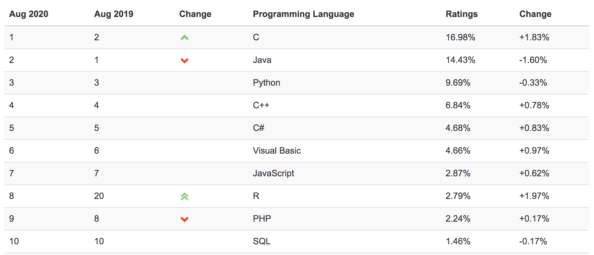
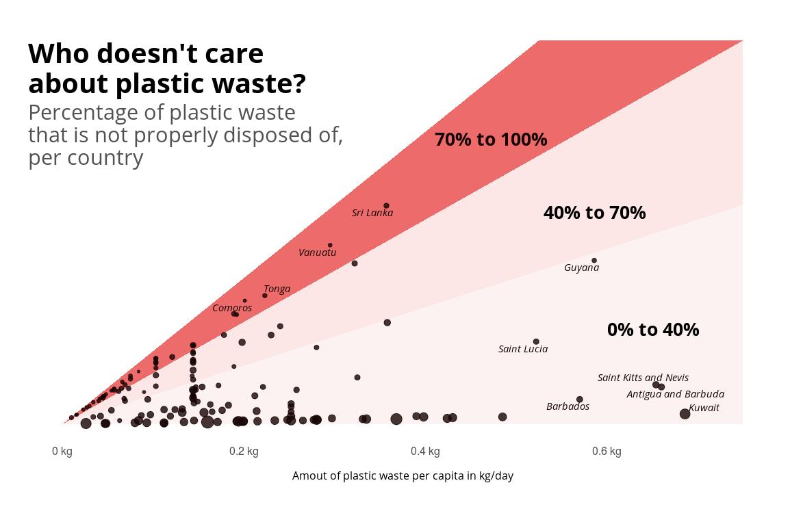
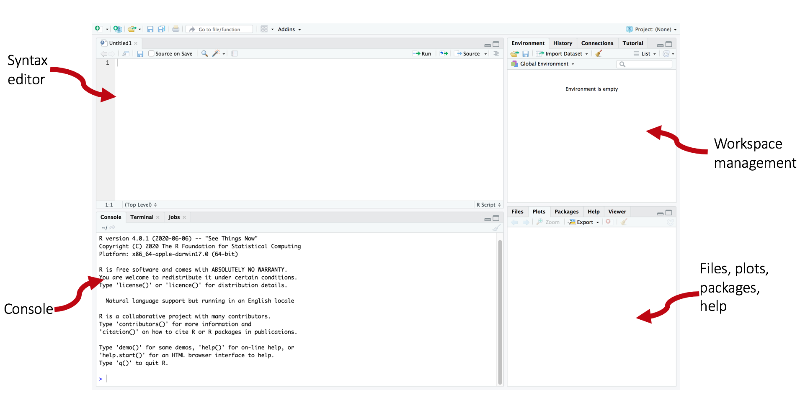
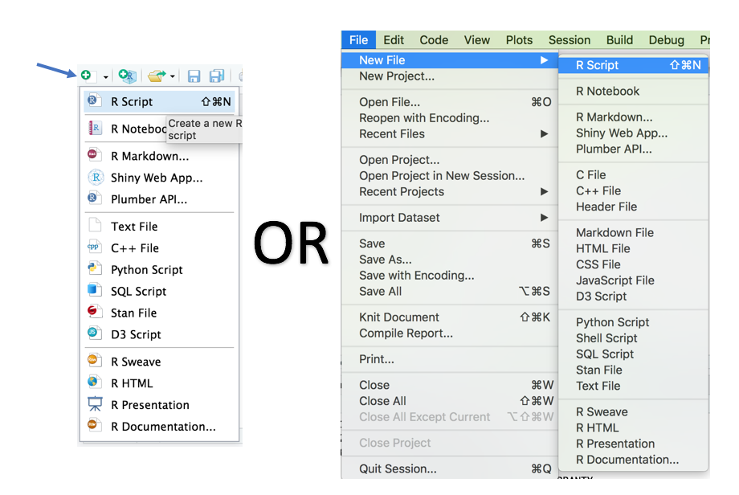
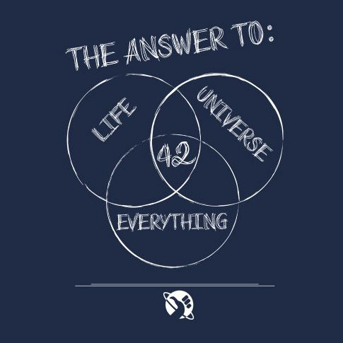

# What will this workshop cover?

The goal of this session is to get to started using RStudio, learn how to use variables and solve basic calculations in R. We will cover:

*  Introduction to RStudio
*  Using r as a calculator
*  Assigning variables
*  Numerical variables

# Information on how the session is run

We will be doing paired programming, to work together:

*  One shares the screen and the other requests remote control.
*  Take turns on who types for each exercise.
*  At the end save the script/markdown document and share it with your teammate in the chat.

What to do when getting stuck:

1)  Ask your team members
2)  Search online:
  *  The answer box on the top of Google's results page 
  *  stackoverflow.com (for task-specific solutions)
  *  https://www.r-bloggers.com/ (topic based tutorials)
3)  Ask the trainer if you struggle to find a solution

Handing in answers - Submit to teams assignment page (*link here*)

# Why R 

R is a popular language, especially in data science, this can be seen in the TIOBE Index for August 2020. 
```{r echo=FALSE}

```

It has lots of strengths:

*  Excellent at handling data
*  Very good for statistics
*  Open source
*  You can do almost anything in R due to community written 'packages'
*  Makes pretty and complex data visualisations (see below)


```{r, echo=FALSE, fig.cap="Credit: Christian Burkhart @ChBurkhart"}

```

***

# Introduction to RStudio

RStudio by default has four main quadrants as shown below. The layout is customisable, as is the background. 
```{r echo=FALSE}

```

When you load RStudio the syntax editor will not be open. Try and open one just like as shown below.
```{r echo=FALSE, scripts}

```

**RStudio demonstration using R Markdown notebooks**

# Starting the session

Open the workshop1.rmd file and save it *can I sent or share files with students?*

*show picture here with text on code chunks and text, using the file I have made*

Remember at the end of the session to share your file with your team mate. You can send the file over the chat

***

# Using R as a calculator

We can use R to do simple or advanced calculations for us. 

```{r}
7 * 6
```

```{r echo=FALSE}

```

```{r}
5 / (2^2)
(16 - 4) + (1 * 9)
```


## Exercise (R as calculator) 

Use R to work out the following arithmetic:

1)  44 times 26
2)  9.6 divided by 1.6
3)  12 + 4 squared
4)  4 * 9 divided by 5 plus 6
5)  22 divided by 36 times 100

# Assigning variables

## Exercise 1 (Assigning variables)

Use R to work out a BMI by assigning them to the variables of weight and height.

*  weight of 90kg
*  height of 1.97m

Then do the calculation using the variables.

```{r eval=FALSE, include=FALSE}
# BMI
weight <- 90
height <- 1.97

weight/(height^2)
```

## Exercise 2 (Assigning variables)

Find the weighted average of a students coursework and exam scores

## exercise 3

VAT on food and drink (or clothes). Use example of USA, tax isn't added to items so you need to work it out yourself to see if you can afford it. 

## Exercise 4

Distance conversions - Kilometers to miles. Kg to pounds. Pints to Litres etc. 

## Exercise 5

Work out the hourly pay of someone on x salary **Have the code but make it wrong so they debug it**

## Assignment

Splitting a restaurant bill between x amount of friends

# Recommended links

Recommended for more information on the RStudio environment: https://rladiessydney.org/courses/ryouwithme/01-basicbasics-1/
