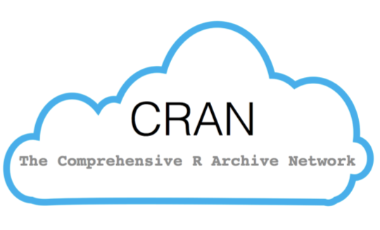

# What will this workshop cover?

In this workshop, the aim is to cover how to load and work with data frames, as well as an introduction to packages. We will be covering:

*  Introduction to packages
*  Loading in data
*  Getting information on data frames
*  Indexing data frames
*  Adjusting row and column names

# Information on how the session is run

One hour exercise based session with tutor support. You will be given example code for a problem, then given a related exercise to complete.

## Why this style?

*  Online training is tiring so keeping the sessions to one hour
*  No or limited demonstrations provided in order to provide more real world experience - you have a problem and you look up how to solve it, adapting example code
*  Trainer support to guide through process of learning

## We will be working in pairs:

*  One shares the screen and the other requests remote control.
*  Take turns on who types for each exercise.
*  Share markdown file at end of session via chat
*  If possible have your camera on when doing the paired work.

## What to do when getting stuck:

1)  Ask your team members
2)  Search online:
  *  The answer box on the top of Google's results page 
  *  stackoverflow.com (for task-specific solutions)
  *  https://www.r-bloggers.com/ (topic based tutorials)
3)  Don't struggle too long looking online, ask the trainer if you can't find a solution!

***

# Introduction to packages

Packages are collections of functions, code, and sample data put together by the R community. Packages are one of the main benefits of R. As R is open source there can be lots of contributors who have made functions to do complex tasks, such as data cleaning, or specific types of data analysis.

To install these packages onto your computer you have to download them from CRAN (The Comprehensive R Archive Network). 

{width=30%}

There are two ways of doing this, using code (recommended and easiest) or using the menus (Tools > Install Packages). 

Using code involves using the install packages function, which looks like: `install.packages("package name")`. To install the package you would type something like:`install.packages("readr")`.

## Installing packages task

Try installing the following packages: `data.table`, `readr`, `readxl` using the `install.packages()` function. 

```{r}
# your code here
```

Once installed, you will not need to do this again unless you install a newer version of R. 

## Loading packages

Now you have installed the packages, you need to load them so you can use them. Each time you load R you will need to re-load the packages you want to use. 

To load a package you need to use the `library()` function. For example, if I wanted to load the `readr` package I would type `library(readr)`.

## Loading packages task

Using `library()` load in the packages you just installed: `data.table`, `readr`, `readxl`.

```{r}
# your code here
```

If you are not sure what packages are loaded, you can use `sessionInfo()`. Run the code below to test it out. Under *other attached packages* you should see readxl, readr, and data.table. 
```{r}
sessionInfo()
```

# What is a data frame

A data frame is a programming object similar to a table. Data frames are commonplace in data science and are needed for most types of analysis. Generally each row contains individual entries (or observations) and each column corresponds to a feature or characteristic of that entry.

Fundamentally, a data frame can contain a mix of different data types (e.g. column 1 is string, column 2 is integer, column 3 is a factor), but a single column in a data frame must be of the same type (e.g. integers, strings, etc.).

{width=40%}

# Making a data frame manually

Before we start loading in data, lets have a look how to make data frames manually. This will help you understand the make up of data frames. 

To make a data frame we use the `data.frame()` function. The easiest way to do this is to make a vector and add that vector into the data frame. Run both examples below and review the output. 

```{r}
str1 <- paste0("person_", seq(1:5))
int1 <- seq(1, 5)
num1 <- c(4,7,2,9,3)
fac1 <- factor(c("yes","yes","no","yes","no"))

data.frame(str1, int1, num1, fac1)
```

Notice how the column names are the same as what you named your vectors. You can rename the columns by adding your column name then equals then your data like: `data.frame(column name = vector)`. See the example below. 

```{r}
str1 <- paste0("person_", seq(1:5))
int1 <- seq(1, 5)
num1 <- c(4,7,2,9,3)
fac1 <- factor(c("yes","yes","no","yes","no"))

data.frame(string = str1, 
           integer = int1, 
           number = num1, 
           factor = fac1)
```

## Manual data frame task

Lets use the data from the coding challenge in R2 looking at Lionel Messi's career. We've got vectors with his goals, club, goals, and appearances. 

Using these vectors make a data frame called `messi_career`. The column names for app and year will have to change to Appearances and Season.

You should end up with a data frame that has the column names Appearances, Goals, Season, and Club.

```{r}
# Vectors with data on Messi's career
app <- c(9,25,36,40,51,53,55,60,50,46,57,49,52,54,50,44)
Goals <- c(1,8,17,16,38,47,53,73,60,41,58,41,54,45,51,31)
year <- c(2004,2005,2006,2007,2008,2009,2010,2011,2012,
            2013,2014,2015,2016,2017,2018,2019)
Club <- rep("FC Barcelona", length(app))

# your code here

```

## Adding columns to the data frame

There are multiple ways of adding data to a data frame. We will cover the most common.

To add a column to a data frame


To add a row to a data frame

```{r}
thisYear <- data.frame(Appearances = 6, Goals = 2, Season = 2020, Club = "FC Barcelona")
age <- seq(17,33)
champLeageGoal <- c(0,1,1,6,9,8,12,14,8,8,10,6,11,6,12,3,1)
```


# Loading in data

When loading data it is important to make sure your data file is in the same directory as your rWorkshop4.Rmd file. Make sure you save both the .csv and .xlsx file in the same file as your .Rmd. 

If you are not sure if your data file is in the same directory as this notebook run the below command to list the files in your directory:
```{r}
list.files()
```

We are going to load in a .csv file and a .xlsx file, two of the most common file types to be loaded into R. 

**hint: an RStudio shortcut to find files is to press tab when the cursor is in the speech marks ("")**
```{r}

```


# Final task - Please give us your individual feedback!

This is the first time that we are exploring a remote learning format for our workshops and we would be grateful if you could take 2 mins before the end of the workshop to get your feedback!

https://lse.eu.qualtrics.com/jfe/form/SV_9zagWkOtzNhmqt7?course=D025-R1NV&topic=R&cohort=MT20

# Individual take home challenge 

