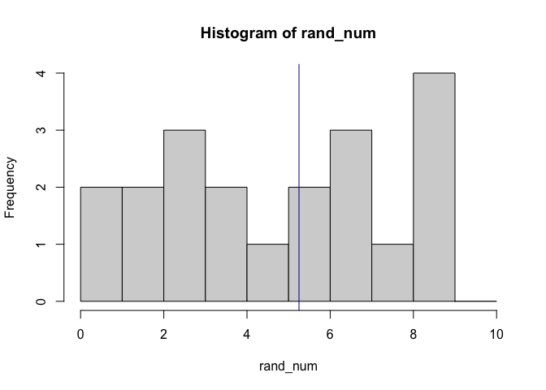

# What this workshop will cover

-   Changing column names
-   Relational joining of datasets
-   Grouping and aggregating your data
-   Rowwise aggregations

## Why this style?

-   Online training is tiring so keeping the sessions to one hour
-   No or limited demonstrations provided in order to provide more real world experience - you have a problem and you look up how to solve it, adapting example code
-   Trainer support to guide through process of learning

## We will be working in pairs:

-   Option to work together on worksheet or to work individually
-   If possible have your camera on and introduce yourself to each other

## What to do when getting stuck:

1)  Ask your team members
2)  Search online:

-   The answer box on the top of Google's results page
-   stackoverflow.com (for task-specific solutions)
-   <https://www.r-bloggers.com/> (topic based tutorials)

3)  Don't struggle too long looking online, ask the trainer if you can't find a solution!

------------------------------------------------------------------------

# Change column names with rename

Before we move into joining and aggregation, it is helpful to learn about the `rename()` function from dplyr, which allows for simple changing of column names. 

The syntax is the same as the `mutate()` function, where we have the name of the column we want to make, then what column we are changing: `data %>% rename(new_column_name = old_column_name)`. 


```r
# load dplyr
library(dplyr)

# Make a data frame
df <- data.frame(
  column1 = rep("Hello", 4),
  column2 = sample(1:10, 4),
  column3 = seq(1:4)
)

df
```

```
##   column1 column2 column3
## 1   Hello       3       1
## 2   Hello       8       2
## 3   Hello       4       3
## 4   Hello       6       4
```

```r
# rename all the columns
df %>%
  rename(string = column1,
         random = column2,
         sequence = column3) -> df_new_col

df_new_col
```

```
##   string random sequence
## 1  Hello      3        1
## 2  Hello      8        2
## 3  Hello      4        3
## 4  Hello      6        4
```

## Rename columns exercise

We will be using the imdb movies dataset again, and code has been provided for you to load it. 

1) Type in and run `names(movies_imdb)` to get the column names of your dataset. This is a nice way to finding the column names, making it easy to copy and paste the names should you need to
2) Using the `rename()` function from dplyr, change `reviews_from_users` to `User_reviews` and `reviews_from_critics` to `Critic_reviews`
3) Save the result back to `movies_imdb`
4) Type in and run `names(movies_imdb)` again to view the new column names

```r
library(readr)
library(dplyr)

movies_imdb <- read_csv("https://raw.githubusercontent.com/andrewmoles2/rTrainIntroduction/master/Workshop6/data/IMDb%20movies.csv")

# your code here
names(movies_imdb)
```

```
##  [1] "imdb_title_id"         "title"                 "year"                 
##  [4] "date_published"        "genre"                 "duration"             
##  [7] "country"               "language"              "director"             
## [10] "writer"                "production_company"    "actors"               
## [13] "description"           "avg_vote"              "votes"                
## [16] "budget"                "usa_gross_income"      "worlwide_gross_income"
## [19] "metascore"             "reviews_from_users"    "reviews_from_critics"
```

```r
movies_imdb %>%
  rename(User_reviews = reviews_from_users,
         Critic_reviews = reviews_from_critics) -> movies_imdb

names(movies_imdb)
```

```
##  [1] "imdb_title_id"         "title"                 "year"                 
##  [4] "date_published"        "genre"                 "duration"             
##  [7] "country"               "language"              "director"             
## [10] "writer"                "production_company"    "actors"               
## [13] "description"           "avg_vote"              "votes"                
## [16] "budget"                "usa_gross_income"      "worlwide_gross_income"
## [19] "metascore"             "User_reviews"          "Critic_reviews"
```

# Joining data

In previous workshops we have introduced how to combine data frames together that have matching columns using the `rbind` and `cbind` functions. Here we will introduce relational (or mutating) joins. This means the data frames are related by common columns, such as a id column, but the rest of the data held is different. 

In our example we will have a person information data frame, with name and age, and a food information data frame with favourite food and allergies; both data frames have a id column which we can use to join them.


```r
# load dplyr
library(dplyr)

# Make a person information data frame
Person_Info <- data.frame(
  ID_num = seq(1:6),
  Name = c("Andrew", "Chloe", "Antony", "Cleopatra", "Zoe", "Nathan"),
  Age = c(28, 26, 19, 35, 21, 42)
  )

Person_Info
```

```
##   ID_num      Name Age
## 1      1    Andrew  28
## 2      2     Chloe  26
## 3      3    Antony  19
## 4      4 Cleopatra  35
## 5      5       Zoe  21
## 6      6    Nathan  42
```

```r
# Make a food information data frame
Food_Info <- data.frame(
  ID = c(1, 4, 7),
  Fav_Food = c("Pizza", "Pasta con il pesto alla Trapanese", "Egg fried rice"),
  Allergic = c(NA, "Soy", "Shellfish")
)

Food_Info
```

```
##   ID                          Fav_Food  Allergic
## 1  1                             Pizza      <NA>
## 2  4 Pasta con il pesto alla Trapanese       Soy
## 3  7                    Egg fried rice Shellfish
```

Dplyr has several functions for joining data, which are based on SQL: 

- `inner_join` finds matches between both data frames
- `left_join` includes all of the data from the left data frame, and matches from the right
- `right_join` includes all of the data from the right data frame, and matches from the left
- `full_join` includes all data from both data frames


First, we can have a look at what a inner join looks like. Try and run the code below.


```r
inner_join(Person_Info, Food_Info)
```
This doesn't work because our column names for our data frames do not match. This is a common error and is easy to fix with the rename function.

{width="600"}

*To view images, either switch to visual markdown editor, or knit document to html*

See the example below, we rename the ID column, then we use the `inner_join()` function again. You can also specify what columns you are joining the data, using the by argument. 

```r
# fix the id column name to match
Person_Info <- Person_Info %>%
  rename(ID = ID_num)

# Inner join (just the id matches)
inner_join(Person_Info, Food_Info)
```

```
## Joining, by = "ID"
```

```
##   ID      Name Age                          Fav_Food Allergic
## 1  1    Andrew  28                             Pizza     <NA>
## 2  4 Cleopatra  35 Pasta con il pesto alla Trapanese      Soy
```

```r
# Specifying what we are joining by
inner_join(Person_Info, Food_Info, by = "ID")
```

```
##   ID      Name Age                          Fav_Food Allergic
## 1  1    Andrew  28                             Pizza     <NA>
## 2  4 Cleopatra  35 Pasta con il pesto alla Trapanese      Soy
```

The left join includes all data from our Person_Info data frame and matches from the Food_Info data frame, anything that doesn't match is scored as a NA. 

{width="600"}


```r
# left join 
left_join(Person_Info, Food_Info)
```

```
## Joining, by = "ID"
```

```
##   ID      Name Age                          Fav_Food Allergic
## 1  1    Andrew  28                             Pizza     <NA>
## 2  2     Chloe  26                              <NA>     <NA>
## 3  3    Antony  19                              <NA>     <NA>
## 4  4 Cleopatra  35 Pasta con il pesto alla Trapanese      Soy
## 5  5       Zoe  21                              <NA>     <NA>
## 6  6    Nathan  42                              <NA>     <NA>
```

The right join is the opposite of the left join. We get everything from Food_Info, and just the matches from Person_Info. Again, anything that doesn't match is given NA. 

{width="600"}


```r
# right join
right_join(Person_Info, Food_Info)
```

```
## Joining, by = "ID"
```

```
##   ID      Name Age                          Fav_Food  Allergic
## 1  1    Andrew  28                             Pizza      <NA>
## 2  4 Cleopatra  35 Pasta con il pesto alla Trapanese       Soy
## 3  7      <NA>  NA                    Egg fried rice Shellfish
```

Finally, the full join brings all the data of both data frames together. Anything that doesn't match is given NA. 

{width="600"}


```r
# full join
full_join(Person_Info, Food_Info)
```

```
## Joining, by = "ID"
```

```
##   ID      Name Age                          Fav_Food  Allergic
## 1  1    Andrew  28                             Pizza      <NA>
## 2  2     Chloe  26                              <NA>      <NA>
## 3  3    Antony  19                              <NA>      <NA>
## 4  4 Cleopatra  35 Pasta con il pesto alla Trapanese       Soy
## 5  5       Zoe  21                              <NA>      <NA>
## 6  6    Nathan  42                              <NA>      <NA>
## 7  7      <NA>  NA                    Egg fried rice Shellfish
```

## Joining data exercise

For this workshop you'll be using the imdb data we used in the previous workshop and we will also be using the Bechdel Test flim data. We will be joining the Bechel data to the imdb dataset. 

The Bechdel test is a measure of the representation of women in fiction. Scoring has three criteria which films are scored on: 1) Film has at least two women in it 2) The two, or more, women talk to each other 3) The two, or more, women talk about something besides a man. Films are scored 0 to 3. They score 0 if they don't meet any of the criteria, and 3 if they meet all of them.

Lets jump in, and load our data. We previously loaded the imdb data, so we will just load the bechdel data using the code I've provided.


```r
library(readr)
library(dplyr)

bechdel <- read_csv("https://raw.githubusercontent.com/andrewmoles2/rTrainIntroduction/master/Workshop6/data/raw_bechdel.csv")

bechdel %>% glimpse()
```

```
## Rows: 8,839
## Columns: 5
## $ year    <dbl> 1888, 1892, 1895, 1895, 1896, 1896, 1896, 1896, 1897, 1898, 18…
## $ id      <dbl> 8040, 5433, 6200, 5444, 5406, 5445, 6199, 4982, 9328, 4978, 54…
## $ imdb_id <dbl> 392728, 3, 132134, 14, 131, 223341, 12, 91, 41, 135696, 224240…
## $ title   <chr> "Roundhay Garden Scene", "Pauvre Pierrot", "The Execution of M…
## $ rating  <dbl> 0, 0, 0, 0, 0, 0, 0, 0, 0, 0, 0, 0, 3, 0, 0, 0, 0, 0, 0, 0, 0,…
```

```r
movies_imdb %>% glimpse()
```

```
## Rows: 85,855
## Columns: 21
## $ imdb_title_id         <chr> "tt0000009", "tt0000574", "tt0001892", "tt000210…
## $ title                 <chr> "Miss Jerry", "The Story of the Kelly Gang", "De…
## $ year                  <dbl> 1894, 1906, 1911, 1912, 1911, 1912, 1919, 1913, …
## $ date_published        <chr> "1894-10-09", "26/12/1906", "19/08/1911", "13/11…
## $ genre                 <chr> "Romance", "Biography, Crime, Drama", "Drama", "…
## $ duration              <dbl> 45, 70, 53, 100, 68, 60, 85, 120, 120, 55, 121, …
## $ country               <chr> "USA", "Australia", "Germany, Denmark", "USA", "…
## $ language              <chr> "None", "None", NA, "English", "Italian", "Engli…
## $ director              <chr> "Alexander Black", "Charles Tait", "Urban Gad", …
## $ writer                <chr> "Alexander Black", "Charles Tait", "Urban Gad, G…
## $ production_company    <chr> "Alexander Black Photoplays", "J. and N. Tait", …
## $ actors                <chr> "Blanche Bayliss, William Courtenay, Chauncey De…
## $ description           <chr> "The adventures of a female reporter in the 1890…
## $ avg_vote              <dbl> 5.9, 6.1, 5.8, 5.2, 7.0, 5.7, 6.8, 6.2, 6.7, 5.5…
## $ votes                 <dbl> 154, 589, 188, 446, 2237, 484, 753, 273, 198, 22…
## $ budget                <chr> NA, "$ 2250", NA, "$ 45000", NA, NA, NA, "ITL 45…
## $ usa_gross_income      <chr> NA, NA, NA, NA, NA, NA, NA, NA, NA, NA, NA, NA, …
## $ worlwide_gross_income <chr> NA, NA, NA, NA, NA, NA, NA, NA, NA, NA, NA, NA, …
## $ metascore             <dbl> NA, NA, NA, NA, NA, NA, NA, NA, NA, NA, NA, NA, …
## $ User_reviews          <dbl> 1, 7, 5, 25, 31, 13, 12, 7, 4, 8, 9, 9, 16, 8, N…
## $ Critic_reviews        <dbl> 2, 7, 2, 3, 14, 5, 9, 5, 1, 1, 9, 28, 7, 23, 4, …
```

To join the data we have to make sure the IDs we will be using to join the data match. First we change the name, then we remove the text from the imdb data `imdb_title_id` column.

1) Using the `rename` function, change the `imdb_title_id` column in movies_imdb to `imdb_id`. Make sure to save the result back to movies_imdb
2) We now need to fix the ids in the movies_imdb dataset. Type the following code to fix the ids: `movies_imdb$imdb_id <- parse_number(movies_imdb$imdb_id)`. The `parse_number()` function is from the readr library, and removes text from strings, which is exactly what we need in this case
3) Using the `inner_join()` function, join together movies_imdb and bechdel data frames. Call the new data frame `imdb_bechdel`
4) Using the `full_join()` function,  join together movies_imdb and bechdel data frames. Call the new data frame `imdb_bechdel_full`
5) Have a look at both your newly joined up data frames using head, glimpse or View. Do you notice how when we used inner_join we filtered out all data that isn't in our bechdel test dataset? 


```r
# your code here

# use rename to change imdb_title_id to imdb_id
movies_imdb %>%
  rename(imdb_id = imdb_title_id) -> movies_imdb

# fix ids so they match (remove tt and 0's)
movies_imdb$imdb_id <- parse_number(movies_imdb$imdb_id)

# inner join to keep just the matches
imdb_bechdel <- inner_join(movies_imdb, bechdel, by = c("imdb_id", "title", "year"))

# full join with everything 
imdb_bechdel_full <- full_join(movies_imdb, bechdel, by = c("imdb_id", "title", "year")) 

imdb_bechdel %>% glimpse()
```

```
## Rows: 6,084
## Columns: 23
## $ imdb_id               <dbl> 574, 2101, 3973, 4972, 6745, 7361, 8443, 8489, 8…
## $ title                 <chr> "The Story of the Kelly Gang", "Cleopatra", "A F…
## $ year                  <dbl> 1906, 1912, 1914, 1915, 1916, 1916, 1917, 1917, …
## $ date_published        <chr> "26/12/1906", "13/11/1912", "04/09/1916", "21/03…
## $ genre                 <chr> "Biography, Crime, Drama", "Drama, History", "Co…
## $ duration              <dbl> 70, 100, 63, 195, 58, 63, 65, 70, 78, 91, 70, 84…
## $ country               <chr> "Australia", "USA", "USA", "USA", "USA", "USA", …
## $ language              <chr> "None", "English", "English", "None", "English",…
## $ director              <chr> "Charles Tait", "Charles L. Gaskill", "Sidney Dr…
## $ writer                <chr> "Charles Tait", "Victorien Sardou", "Marguerite …
## $ production_company    <chr> "J. and N. Tait", "Helen Gardner Picture Players…
## $ actors                <chr> "Elizabeth Tait, John Tait, Norman Campbell, Bel…
## $ description           <chr> "True story of notorious Australian outlaw Ned K…
## $ avg_vote              <dbl> 6.1, 5.2, 5.8, 6.3, 5.7, 6.2, 6.7, 6.4, 6.1, 5.7…
## $ votes                 <dbl> 589, 446, 202, 22213, 479, 349, 1266, 130, 770, …
## $ budget                <chr> "$ 2250", "$ 45000", NA, "$ 100000", NA, NA, NA,…
## $ usa_gross_income      <chr> NA, NA, NA, NA, NA, NA, NA, NA, NA, NA, NA, NA, …
## $ worlwide_gross_income <chr> NA, NA, NA, NA, NA, NA, NA, NA, NA, NA, NA, NA, …
## $ metascore             <dbl> NA, NA, NA, NA, NA, NA, NA, NA, NA, NA, NA, NA, …
## $ User_reviews          <dbl> 7, 25, 6, 368, 7, 13, 16, 3, 9, 12, 6, 19, 14, 8…
## $ Critic_reviews        <dbl> 7, 3, 3, 97, 1, 5, 13, 3, 5, 4, 1, 11, 21, 78, 6…
## $ id                    <dbl> 1349, 2003, 4457, 1258, 2008, 7004, 1994, 2019, …
## $ rating                <dbl> 1, 2, 2, 2, 3, 3, 3, 2, 3, 0, 3, 3, 3, 0, 3, 3, …
```

```r
imdb_bechdel_full %>% glimpse()
```

```
## Rows: 88,614
## Columns: 23
## $ imdb_id               <dbl> 9, 574, 1892, 2101, 2130, 2199, 2423, 2445, 2452…
## $ title                 <chr> "Miss Jerry", "The Story of the Kelly Gang", "De…
## $ year                  <dbl> 1894, 1906, 1911, 1912, 1911, 1912, 1919, 1913, …
## $ date_published        <chr> "1894-10-09", "26/12/1906", "19/08/1911", "13/11…
## $ genre                 <chr> "Romance", "Biography, Crime, Drama", "Drama", "…
## $ duration              <dbl> 45, 70, 53, 100, 68, 60, 85, 120, 120, 55, 121, …
## $ country               <chr> "USA", "Australia", "Germany, Denmark", "USA", "…
## $ language              <chr> "None", "None", NA, "English", "Italian", "Engli…
## $ director              <chr> "Alexander Black", "Charles Tait", "Urban Gad", …
## $ writer                <chr> "Alexander Black", "Charles Tait", "Urban Gad, G…
## $ production_company    <chr> "Alexander Black Photoplays", "J. and N. Tait", …
## $ actors                <chr> "Blanche Bayliss, William Courtenay, Chauncey De…
## $ description           <chr> "The adventures of a female reporter in the 1890…
## $ avg_vote              <dbl> 5.9, 6.1, 5.8, 5.2, 7.0, 5.7, 6.8, 6.2, 6.7, 5.5…
## $ votes                 <dbl> 154, 589, 188, 446, 2237, 484, 753, 273, 198, 22…
## $ budget                <chr> NA, "$ 2250", NA, "$ 45000", NA, NA, NA, "ITL 45…
## $ usa_gross_income      <chr> NA, NA, NA, NA, NA, NA, NA, NA, NA, NA, NA, NA, …
## $ worlwide_gross_income <chr> NA, NA, NA, NA, NA, NA, NA, NA, NA, NA, NA, NA, …
## $ metascore             <dbl> NA, NA, NA, NA, NA, NA, NA, NA, NA, NA, NA, NA, …
## $ User_reviews          <dbl> 1, 7, 5, 25, 31, 13, 12, 7, 4, 8, 9, 9, 16, 8, N…
## $ Critic_reviews        <dbl> 2, 7, 2, 3, 14, 5, 9, 5, 1, 1, 9, 28, 7, 23, 4, …
## $ id                    <dbl> NA, 1349, NA, 2003, NA, NA, NA, NA, NA, NA, NA, …
## $ rating                <dbl> NA, 1, NA, 2, NA, NA, NA, NA, NA, NA, NA, NA, NA…
```


# Aggregation

Table and count functions

# Grouping

More exciting aggregation using group_by

# Rowwise aggregation

Performing aggregation of rows using either RowMeans or rowwise

------------------------------------------------------------------------

## Extra: Sampling explaination

If you are curious about how the `sample()` function works, which we used earlier, run the below code several times, reviewing the histogram it produces. This process is known as sampling with replacement, which means from our sample (numbers 1 to 10) we randomly extract a set number of values (20 in our example) which can be duplicates (extract the same number more than once).


```r
# sample with replacement
rand_num <- sample(1:10, 20, replace = TRUE)
# plot using hist function
hist(rand_num, breaks = 0:10)
# add line for mean
abline(v=mean(rand_num),col="darkblue")
```

<!-- -->

Sampling without replacement means we don't extract the same number more than once, this means the number we extract must be less than the amount of data in our sample; in our second example we have 1 to 10 and are extract 5 values.


```r
# sample without replacement
rand_num2 <- sample(1:10, 5, replace = FALSE)
# plot using hist function
hist(rand_num2, breaks = 0:10)
# add line for mean
abline(v=mean(rand_num2),col="darkgreen")
```

<!-- -->
