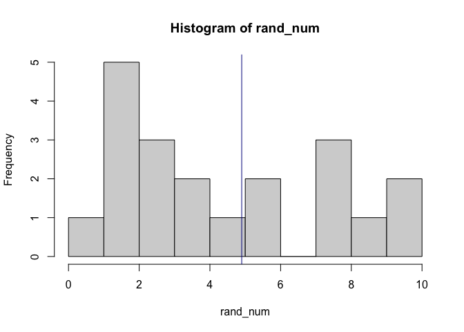
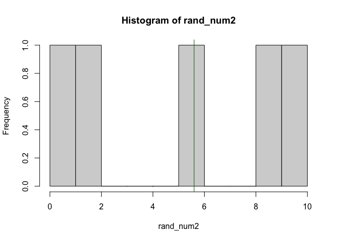

# What this workshop will cover

-  Relational joining of datasets
-  Grouping and aggregating your data
-  Rowwise aggregations

## Why this style?

-   Online training is tiring so keeping the sessions to one hour
-   No or limited demonstrations provided in order to provide more real world experience - you have a problem and you look up how to solve it, adapting example code
-   Trainer support to guide through process of learning

## We will be working in pairs:

-   Option to work together on worksheet or to work individually
-   If possible have your camera on and introduce yourself to each other

## What to do when getting stuck:

1)  Ask your team members
2)  Search online:
-   The answer box on the top of Google's results page
-   stackoverflow.com (for task-specific solutions)
-   <https://www.r-bloggers.com/> (topic based tutorials)
3)  Don't struggle too long looking online, ask the trainer if you can't find a solution!

------------------------------------------------------------------------

# Joining data


```r
# load dplyr
library(dplyr)
```

```
## 
## Attaching package: 'dplyr'
```

```
## The following objects are masked from 'package:stats':
## 
##     filter, lag
```

```
## The following objects are masked from 'package:base':
## 
##     intersect, setdiff, setequal, union
```

```r
# Make a person information data frame
Person_Info <- data.frame(
  ID_num = seq(1:6),
  Name = c("Andrew", "Chloe", "Antony", "Cleopatra", "Zoe", "Nathan"),
  Age = c(28, 26, 19, 35, 21, 42)
  )

Person_Info
```

```
##   ID_num      Name Age
## 1      1    Andrew  28
## 2      2     Chloe  26
## 3      3    Antony  19
## 4      4 Cleopatra  35
## 5      5       Zoe  21
## 6      6    Nathan  42
```

```r
# Make a food information data frame
Food_Info <- data.frame(
  ID = c(1, 4, 7),
  Fav_Food = c("Pizza", "Pasta con il pesto alla Trapanese", "Egg fried rice"),
  Allergic = c(NA, "Soy", "Shellfish")
)

Food_Info
```

```
##   ID                          Fav_Food  Allergic
## 1  1                             Pizza      <NA>
## 2  4 Pasta con il pesto alla Trapanese       Soy
## 3  7                    Egg fried rice Shellfish
```


```r
# doesn't work...
inner_join(Person_Info, Food_Info)
```


```r
# fix the id column name to match
Person_Info <- Person_Info %>%
  rename(ID = ID_num)

# Inner join (just the id matches)
inner_join(Person_Info, Food_Info)
```

```
## Joining, by = "ID"
```

```
##   ID      Name Age                          Fav_Food Allergic
## 1  1    Andrew  28                             Pizza     <NA>
## 2  4 Cleopatra  35 Pasta con il pesto alla Trapanese      Soy
```

```r
# left join 
left_join(Person_Info, Food_Info)
```

```
## Joining, by = "ID"
```

```
##   ID      Name Age                          Fav_Food Allergic
## 1  1    Andrew  28                             Pizza     <NA>
## 2  2     Chloe  26                              <NA>     <NA>
## 3  3    Antony  19                              <NA>     <NA>
## 4  4 Cleopatra  35 Pasta con il pesto alla Trapanese      Soy
## 5  5       Zoe  21                              <NA>     <NA>
## 6  6    Nathan  42                              <NA>     <NA>
```

```r
# right join
right_join(Person_Info, Food_Info)
```

```
## Joining, by = "ID"
```

```
##   ID      Name Age                          Fav_Food  Allergic
## 1  1    Andrew  28                             Pizza      <NA>
## 2  4 Cleopatra  35 Pasta con il pesto alla Trapanese       Soy
## 3  7      <NA>  NA                    Egg fried rice Shellfish
```

```r
# full join
full_join(Person_Info, Food_Info)
```

```
## Joining, by = "ID"
```

```
##   ID      Name Age                          Fav_Food  Allergic
## 1  1    Andrew  28                             Pizza      <NA>
## 2  2     Chloe  26                              <NA>      <NA>
## 3  3    Antony  19                              <NA>      <NA>
## 4  4 Cleopatra  35 Pasta con il pesto alla Trapanese       Soy
## 5  5       Zoe  21                              <NA>      <NA>
## 6  6    Nathan  42                              <NA>      <NA>
## 7  7      <NA>  NA                    Egg fried rice Shellfish
```


## Joining data exercise

For this workshop you'll be using the imdb data we used in the previous workshop. We will also be using the Bechdel Test flim data. What is the Bechdel test?

The Bechdel test is a simple test with three criteria, which films are scored on:
1) Film has at least two women in it
2) The two, or more, women talk to each other
3) The two, or more, women talk about something besides a man

Films are scored 0 to 3. They score 0 if they don't meet any of the criteria, and 3 if they meet all of them. 

Lets jump in, and load our data. I've provided the code for loading the data. 

To join the data we have to make sure our joining Id's match. First we change the name, then we remove the text from the imdb data `imdb_title_id` column. 


```r
library(readr)
library(dplyr)

movies_imdb <- read_csv("https://raw.githubusercontent.com/andrewmoles2/rTrainIntroduction/master/Workshop6/data/IMDb%20movies.csv")
```

```
## 
## ── Column specification ────────────────────────────────────────────────────────
## cols(
##   .default = col_character(),
##   year = col_double(),
##   duration = col_double(),
##   avg_vote = col_double(),
##   votes = col_double(),
##   metascore = col_double(),
##   reviews_from_users = col_double(),
##   reviews_from_critics = col_double()
## )
## ℹ Use `spec()` for the full column specifications.
```

```
## Warning: 1 parsing failure.
##   row  col expected        actual                                                                                                        file
## 83918 year a double TV Movie 2019 'https://raw.githubusercontent.com/andrewmoles2/rTrainIntroduction/master/Workshop6/data/IMDb%20movies.csv'
```

```r
bechdel <- read_csv("https://raw.githubusercontent.com/andrewmoles2/rTrainIntroduction/master/Workshop6/data/raw_bechdel.csv")
```

```
## 
## ── Column specification ────────────────────────────────────────────────────────
## cols(
##   year = col_double(),
##   id = col_double(),
##   imdb_id = col_double(),
##   title = col_character(),
##   rating = col_double()
## )
```

```r
# use rename to change imdb_title_id to imdb_id
movies_imdb %>%
  rename(imdb_id = imdb_title_id) -> movies_imdb

# fix ids so they match (remove tt and 0's)
movies_imdb$imdb_id <- parse_number(movies_imdb$imdb_id)

head(bechdel)
```

```
## # A tibble: 6 x 5
##    year    id imdb_id title                                 rating
##   <dbl> <dbl>   <dbl> <chr>                                  <dbl>
## 1  1888  8040  392728 Roundhay Garden Scene                      0
## 2  1892  5433       3 Pauvre Pierrot                             0
## 3  1895  6200  132134 The Execution of Mary, Queen of Scots      0
## 4  1895  5444      14 Tables Turned on the Gardener              0
## 5  1896  5406     131 Une nuit terrible                          0
## 6  1896  5445  223341 La fee aux choux                           0
```

```r
head(movies_imdb)
```

```
## # A tibble: 6 x 21
##   imdb_id title    year date_published genre  duration country language director
##     <dbl> <chr>   <dbl> <chr>          <chr>     <dbl> <chr>   <chr>    <chr>   
## 1       9 Miss J…  1894 1894-10-09     Roman…       45 USA     None     Alexand…
## 2     574 The St…  1906 26/12/1906     Biogr…       70 Austra… None     Charles…
## 3    1892 Den so…  1911 19/08/1911     Drama        53 German… <NA>     Urban G…
## 4    2101 Cleopa…  1912 13/11/1912     Drama…      100 USA     English  Charles…
## 5    2130 L'Infe…  1911 06/03/1911     Adven…       68 Italy   Italian  Frances…
## 6    2199 From t…  1912 1913           Biogr…       60 USA     English  Sidney …
## # … with 12 more variables: writer <chr>, production_company <chr>,
## #   actors <chr>, description <chr>, avg_vote <dbl>, votes <dbl>, budget <chr>,
## #   usa_gross_income <chr>, worlwide_gross_income <chr>, metascore <dbl>,
## #   reviews_from_users <dbl>, reviews_from_critics <dbl>
```

```r
test_join <- inner_join(movies_imdb, bechdel, by = c("imdb_id", "title", "year")) %>%
  select(-id)
```

***

## Extra: Sampling explaination

If you are curious about how the `sample()` function works, which we used earlier, run the below code several times, reviewing the histogram it produces. This process is known as sampling with replacement, which means from our sample (numbers 1 to 10) we randomly extract a set number of values (20 in our example) which can be duplicates (extract the same number more than once). 


```r
# sample with replacement
rand_num <- sample(1:10, 20, replace = TRUE)
# plot using hist function
hist(rand_num, breaks = 0:10)
# add line for mean
abline(v=mean(rand_num),col="darkblue")
```

<!-- -->

Sampling without replacement means we don't extract the same number more than once, this means the number we extract must be less than the amount of data in our sample; in our second example we have 1 to 10 and are extract 5 values.


```r
# sample without replacement
rand_num2 <- sample(1:10, 5, replace = FALSE)
# plot using hist function
hist(rand_num2, breaks = 0:10)
# add line for mean
abline(v=mean(rand_num2),col="darkgreen")
```

<!-- -->


