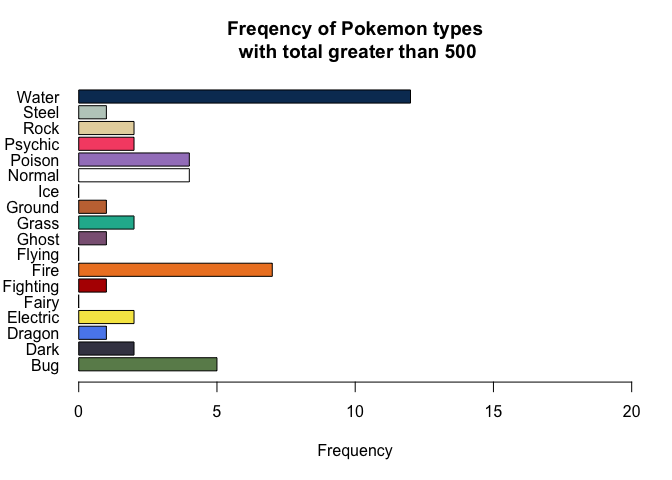

# Objective of workshop

To manipulate and create new columns using the mutate function from dplyr, as well as cleaning column names.

# What this workshop will cover

In this workshop, the aim is to cover how to perform data wrangling tasks on columns using dplyr. We will be covering:

-   Data manipulation with mutate from dplyr
-   Renaming columns
-   Cleaning up column names with janitor
-   Vectorised if statements with case_when

------------------------------------------------------------------------

# The mutate function

The mutate function is from the dplyr library, and is for making, modifying, or deleting columns in your dataset. Similar to what we have done in previous sessions, mutate allows you to make a new column from a calculation you have made.

{width="516"}

The main difference between using mutate and making new columns in base R, is that mutate is smarter. You can create a new column based on a new column you have just made within mutate, which you can't do in base R. Lets look at some examples with our messi data we used in the last session.

In our previous workshops, we calculated Messi's goals per game (goals/appearances). We can do this with mutate. Notice the syntax, we give the name we want to call our new column first, then =, then what we want to do (e.g. a calculation); `mutate(new_column = x/y)`.

*note: when loading dplyr you also load the magrittr library for piping*


```r
# load dplyr
library(dplyr)

# create the messi career data
messi_career <- data.frame(Appearances = c(9,25,36,40,51,53,55,60,50,46,57,49,52,54,50,44),
                           Goals = c(1,8,17,16,38,47,53,73,60,41,58,41,54,45,51,31),
                           Season = c(2004,2005,2006,2007,2008,2009,2010,2011,2012,
            2013,2014,2015,2016,2017,2018,2019),
                           Club = rep("FC Barcelona", 16),
                          Age = seq(17, 32),
                          champLeagueGoal = c(0,1,1,6,9,8,12,14,8,8,10,6,11,6,12,3))
# view the data
head(messi_career)
```

```
##   Appearances Goals Season         Club Age champLeagueGoal
## 1           9     1   2004 FC Barcelona  17               0
## 2          25     8   2005 FC Barcelona  18               1
## 3          36    17   2006 FC Barcelona  19               1
## 4          40    16   2007 FC Barcelona  20               6
## 5          51    38   2008 FC Barcelona  21               9
## 6          53    47   2009 FC Barcelona  22               8
```

```r
# calculate the goal to appearance ratio
messi_career %>%
  mutate(goal_ratio = Goals/Appearances)
```

```
##    Appearances Goals Season         Club Age champLeagueGoal goal_ratio
## 1            9     1   2004 FC Barcelona  17               0  0.1111111
## 2           25     8   2005 FC Barcelona  18               1  0.3200000
## 3           36    17   2006 FC Barcelona  19               1  0.4722222
## 4           40    16   2007 FC Barcelona  20               6  0.4000000
## 5           51    38   2008 FC Barcelona  21               9  0.7450980
## 6           53    47   2009 FC Barcelona  22               8  0.8867925
## 7           55    53   2010 FC Barcelona  23              12  0.9636364
## 8           60    73   2011 FC Barcelona  24              14  1.2166667
## 9           50    60   2012 FC Barcelona  25               8  1.2000000
## 10          46    41   2013 FC Barcelona  26               8  0.8913043
## 11          57    58   2014 FC Barcelona  27              10  1.0175439
## 12          49    41   2015 FC Barcelona  28               6  0.8367347
## 13          52    54   2016 FC Barcelona  29              11  1.0384615
## 14          54    45   2017 FC Barcelona  30               6  0.8333333
## 15          50    51   2018 FC Barcelona  31              12  1.0200000
## 16          44    31   2019 FC Barcelona  32               3  0.7045455
```

The new column, goal_ratio in this case, will automatically be added to the end of your data frame. This is the same behaviour you will see when using base R. This behaviour can be altered if you want, but we won't have time to cover it here.

What makes `mutate()` powerful, is the ability to do multiple calculations in one statement, as well as using newly made columns. See the below example which will help to understand this. We will use goal_ratio to find out the difference between goal_ratio and the average goal ratio for each row (or season).


```r
# calculate goal ratio and diff from mean
messi_career <- messi_career %>%
  mutate(
    goal_ratio = round(Goals/Appearances, digits = 2),
    diff_avg_goal_ratio = goal_ratio - (mean(Goals) / mean(Appearances)))

# print result
messi_career
```

```
##    Appearances Goals Season         Club Age champLeagueGoal goal_ratio
## 1            9     1   2004 FC Barcelona  17               0       0.11
## 2           25     8   2005 FC Barcelona  18               1       0.32
## 3           36    17   2006 FC Barcelona  19               1       0.47
## 4           40    16   2007 FC Barcelona  20               6       0.40
## 5           51    38   2008 FC Barcelona  21               9       0.75
## 6           53    47   2009 FC Barcelona  22               8       0.89
## 7           55    53   2010 FC Barcelona  23              12       0.96
## 8           60    73   2011 FC Barcelona  24              14       1.22
## 9           50    60   2012 FC Barcelona  25               8       1.20
## 10          46    41   2013 FC Barcelona  26               8       0.89
## 11          57    58   2014 FC Barcelona  27              10       1.02
## 12          49    41   2015 FC Barcelona  28               6       0.84
## 13          52    54   2016 FC Barcelona  29              11       1.04
## 14          54    45   2017 FC Barcelona  30               6       0.83
## 15          50    51   2018 FC Barcelona  31              12       1.02
## 16          44    31   2019 FC Barcelona  32               3       0.70
##    diff_avg_goal_ratio
## 1          -0.75730506
## 2          -0.54730506
## 3          -0.39730506
## 4          -0.46730506
## 5          -0.11730506
## 6           0.02269494
## 7           0.09269494
## 8           0.35269494
## 9           0.33269494
## 10          0.02269494
## 11          0.15269494
## 12         -0.02730506
## 13          0.17269494
## 14         -0.03730506
## 15          0.15269494
## 16         -0.16730506
```

We can then pipe this result to `filter()`, which allows us to see which seasons Messi has a goal ratio above his average goal ratio.


```r
messi_career %>%
  mutate(
    goal_ratio = round(Goals/Appearances, digits = 2),
    diff_avg_goal_ratio = goal_ratio - (mean(Goals) / mean(Appearances))) %>%
  filter(diff_avg_goal_ratio > 0)
```

```
##   Appearances Goals Season         Club Age champLeagueGoal goal_ratio
## 1          53    47   2009 FC Barcelona  22               8       0.89
## 2          55    53   2010 FC Barcelona  23              12       0.96
## 3          60    73   2011 FC Barcelona  24              14       1.22
## 4          50    60   2012 FC Barcelona  25               8       1.20
## 5          46    41   2013 FC Barcelona  26               8       0.89
## 6          57    58   2014 FC Barcelona  27              10       1.02
## 7          52    54   2016 FC Barcelona  29              11       1.04
## 8          50    51   2018 FC Barcelona  31              12       1.02
##   diff_avg_goal_ratio
## 1          0.02269494
## 2          0.09269494
## 3          0.35269494
## 4          0.33269494
## 5          0.02269494
## 6          0.15269494
## 7          0.17269494
## 8          0.15269494
```

## Mutate exercise 1

We will be using the imdb movies dataset again for this workshop. Use the code below to load in the data.


```r
# load libraries
library(readr)
library(dplyr)

# load data
movies_imdb <- read_csv("https://raw.githubusercontent.com/andrewmoles2/rTrainIntroduction/main/r-data-wrangling-1/data/IMDb%20movies.csv")

# use glimpse to review data (tidyverse version of str())
movies_imdb %>% glimpse()
```

```
## Rows: 85,855
## Columns: 21
## $ imdb_title_id         <chr> "tt0000009", "tt0000574", "tt0001892", "tt000210…
## $ title                 <chr> "Miss Jerry", "The Story of the Kelly Gang", "De…
## $ year                  <dbl> 1894, 1906, 1911, 1912, 1911, 1912, 1919, 1913, …
## $ date_published        <chr> "1894-10-09", "26/12/1906", "19/08/1911", "13/11…
## $ genre                 <chr> "Romance", "Biography, Crime, Drama", "Drama", "…
## $ duration              <dbl> 45, 70, 53, 100, 68, 60, 85, 120, 120, 55, 121, …
## $ country               <chr> "USA", "Australia", "Germany, Denmark", "USA", "…
## $ language              <chr> "None", "None", NA, "English", "Italian", "Engli…
## $ director              <chr> "Alexander Black", "Charles Tait", "Urban Gad", …
## $ writer                <chr> "Alexander Black", "Charles Tait", "Urban Gad, G…
## $ production_company    <chr> "Alexander Black Photoplays", "J. and N. Tait", …
## $ actors                <chr> "Blanche Bayliss, William Courtenay, Chauncey De…
## $ description           <chr> "The adventures of a female reporter in the 1890…
## $ avg_vote              <dbl> 5.9, 6.1, 5.8, 5.2, 7.0, 5.7, 6.8, 6.2, 6.7, 5.5…
## $ votes                 <dbl> 154, 589, 188, 446, 2237, 484, 753, 273, 198, 22…
## $ budget                <chr> NA, "$ 2250", NA, "$ 45000", NA, NA, NA, "ITL 45…
## $ usa_gross_income      <chr> NA, NA, NA, NA, NA, NA, NA, NA, NA, NA, NA, NA, …
## $ worlwide_gross_income <chr> NA, NA, NA, NA, NA, NA, NA, NA, NA, NA, NA, NA, …
## $ metascore             <dbl> NA, NA, NA, NA, NA, NA, NA, NA, NA, NA, NA, NA, …
## $ reviews_from_users    <dbl> 1, 7, 5, 25, 31, 13, 12, 7, 4, 8, 9, 9, 16, 8, N…
## $ reviews_from_critics  <dbl> 2, 7, 2, 3, 14, 5, 9, 5, 1, 1, 9, 28, 7, 23, 4, …
```

Lets pretend we are interested in the difference between the number of user reviews and critic reviews for each film in our movies_imdb dataset. We can use mutate to explore this difference a bit further.

1)  Pipe your movies_imdb data to a `mutate()` function. Make a new column called `user_critic_ratio`, and divide `reviews_from_users` by `reviews_from_critics`. Wrap the result in a `round()` function, rounding by two digits
2)  Now pipe to a `filter()` function, filtering country to be USA and year to be 1989
3)  Now pipe to a `select()` function, selecting the title, avg_vote and user_critic_ratio columns
4)  Now pipe to a `slice_max` function, extracting rows that had the top 10 avg_rating

You should get a data frame returned that has films including: The Abyss, Dead Poets Society, Do the Right Thing, and Glory.


```r
# your code here

# user critic review ratio
movies_imdb %>%
  mutate(user_critic_ratio = round(reviews_from_users / reviews_from_critics, digits = 2)) %>%
  filter(country == "USA" & year == 1989) %>%
  select(title, avg_vote, user_critic_ratio) %>%
  slice_max(avg_vote, n = 10)
```

```
## # A tibble: 10 × 3
##    title                                 avg_vote user_critic_ratio
##    <chr>                                    <dbl>             <dbl>
##  1 Indiana Jones and the Last Crusade         8.2              3.42
##  2 Dead Poets Society                         8.1              5.98
##  3 Crimes and Misdemeanors                    7.9              1.78
##  4 Do the Right Thing                         7.9              4.72
##  5 Back to the Future Part II                 7.8              2.83
##  6 Glory                                      7.8              6.18
##  7 The Abyss                                  7.6              4.08
##  8 The Little Mermaid                         7.6              1.89
##  9 National Lampoon's Christmas Vacation      7.6              3.42
## 10 When Harry Met Sally...                    7.6              2.57
```

We can see we get more user reviews than critic reviews, which makes sense; for example, the The Abyss has 4 user reviews for each critic review.

## Mutate exercise 2

In our second mutate exercise, you will need to de-bug the code to get it running! You may need to re-order some elements of the code as well as checking for other errors.

We are filtering the movies_imdb data for films that are:

-   From the USA before the year 1990
-   Have a duration less than 120 minutes
-   An average vote greater than 8.5

We will also be using the user_critic_ratio column to make it into a string for easier reading.

You should end up with a data frame with 6 rows, and 4 columns (title, year, avg_vote, and ratio_string). The final column, ratio_string, should have an output like "Psycho has a user to critic ratio of 5.44".


```r
# your code here
usa_pre90_high <- movies_imdb %%
  mutate(user_critic_ratio = round(reviews_from_users / reviews_from_critics, digits = 2),
         ratio_string = paste(title, "has a user to critic ratio of", userCriticRatio)) %>%
  filter(country == "USA" & year < 1990) 
  select(title, year, avg_vote, ratio_string) %>%
  filter(duration < 120 & avg_vote >= 8.5)
  
usa_pre90_high
```


```r
# answer for solutions
# Re using the user_critic_ratio variable

usa_pre90_high <- movies_imdb %>%
  mutate(user_critic_ratio = round(reviews_from_users / reviews_from_critics, digits = 2),
         ratio_string = paste(title, "has a user to critic ratio of", user_critic_ratio)) %>%
  filter(country == "USA" & year < 1990) %>%
  filter(duration < 120 & avg_vote >= 8.5) %>%
  select(title, year, avg_vote, ratio_string)

usa_pre90_high
```

```
## # A tibble: 6 × 4
##   title               year avg_vote ratio_string                                
##   <chr>              <dbl>    <dbl> <chr>                                       
## 1 City Lights         1931      8.5 City Lights has a user to critic ratio of 2…
## 2 Modern Times        1936      8.5 Modern Times has a user to critic ratio of …
## 3 Casablanca          1942      8.5 Casablanca has a user to critic ratio of 6.…
## 4 12 Angry Men        1957      8.9 12 Angry Men has a user to critic ratio of …
## 5 Psycho              1960      8.5 Psycho has a user to critic ratio of 5.44   
## 6 Back to the Future  1985      8.5 Back to the Future has a user to critic rat…
```

# Mutate with the across function

We can take the mutate function further by using the `across()` function. This allows us to perform operations (do something) across multiple columns. This is very useful for doing type conversions in an efficient way.

The across function works in a similar way to the `select()` function, but if you want to pick out a few columns you have to use the `c()` function. See the examples below, where we have selected two columns, or used a slice to select out a few columns that are next to each other.


```r
# perform round (to 1 decimal place) across selected columns
messi_career %>%
  mutate(across(c(goal_ratio, diff_avg_goal_ratio), round, digits = 1))
```

```
## Warning: There was 1 warning in `mutate()`.
## ℹ In argument: `across(c(goal_ratio, diff_avg_goal_ratio), round, digits = 1)`.
## Caused by warning:
## ! The `...` argument of `across()` is deprecated as of dplyr 1.1.0.
## Supply arguments directly to `.fns` through an anonymous function instead.
## 
##   # Previously
##   across(a:b, mean, na.rm = TRUE)
## 
##   # Now
##   across(a:b, \(x) mean(x, na.rm = TRUE))
```

```
##    Appearances Goals Season         Club Age champLeagueGoal goal_ratio
## 1            9     1   2004 FC Barcelona  17               0        0.1
## 2           25     8   2005 FC Barcelona  18               1        0.3
## 3           36    17   2006 FC Barcelona  19               1        0.5
## 4           40    16   2007 FC Barcelona  20               6        0.4
## 5           51    38   2008 FC Barcelona  21               9        0.8
## 6           53    47   2009 FC Barcelona  22               8        0.9
## 7           55    53   2010 FC Barcelona  23              12        1.0
## 8           60    73   2011 FC Barcelona  24              14        1.2
## 9           50    60   2012 FC Barcelona  25               8        1.2
## 10          46    41   2013 FC Barcelona  26               8        0.9
## 11          57    58   2014 FC Barcelona  27              10        1.0
## 12          49    41   2015 FC Barcelona  28               6        0.8
## 13          52    54   2016 FC Barcelona  29              11        1.0
## 14          54    45   2017 FC Barcelona  30               6        0.8
## 15          50    51   2018 FC Barcelona  31              12        1.0
## 16          44    31   2019 FC Barcelona  32               3        0.7
##    diff_avg_goal_ratio
## 1                 -0.8
## 2                 -0.5
## 3                 -0.4
## 4                 -0.5
## 5                 -0.1
## 6                  0.0
## 7                  0.1
## 8                  0.4
## 9                  0.3
## 10                 0.0
## 11                 0.2
## 12                 0.0
## 13                 0.2
## 14                 0.0
## 15                 0.2
## 16                -0.2
```

```r
# square root across columns selected with slice
messi_career %>%
  mutate(across(1:3, sqrt))
```

```
##    Appearances    Goals   Season         Club Age champLeagueGoal goal_ratio
## 1     3.000000 1.000000 44.76606 FC Barcelona  17               0       0.11
## 2     5.000000 2.828427 44.77723 FC Barcelona  18               1       0.32
## 3     6.000000 4.123106 44.78839 FC Barcelona  19               1       0.47
## 4     6.324555 4.000000 44.79955 FC Barcelona  20               6       0.40
## 5     7.141428 6.164414 44.81071 FC Barcelona  21               9       0.75
## 6     7.280110 6.855655 44.82187 FC Barcelona  22               8       0.89
## 7     7.416198 7.280110 44.83302 FC Barcelona  23              12       0.96
## 8     7.745967 8.544004 44.84417 FC Barcelona  24              14       1.22
## 9     7.071068 7.745967 44.85532 FC Barcelona  25               8       1.20
## 10    6.782330 6.403124 44.86647 FC Barcelona  26               8       0.89
## 11    7.549834 7.615773 44.87761 FC Barcelona  27              10       1.02
## 12    7.000000 6.403124 44.88875 FC Barcelona  28               6       0.84
## 13    7.211103 7.348469 44.89989 FC Barcelona  29              11       1.04
## 14    7.348469 6.708204 44.91102 FC Barcelona  30               6       0.83
## 15    7.071068 7.141428 44.92215 FC Barcelona  31              12       1.02
## 16    6.633250 5.567764 44.93328 FC Barcelona  32               3       0.70
##    diff_avg_goal_ratio
## 1          -0.75730506
## 2          -0.54730506
## 3          -0.39730506
## 4          -0.46730506
## 5          -0.11730506
## 6           0.02269494
## 7           0.09269494
## 8           0.35269494
## 9           0.33269494
## 10          0.02269494
## 11          0.15269494
## 12         -0.02730506
## 13          0.17269494
## 14         -0.03730506
## 15          0.15269494
## 16         -0.16730506
```

```r
# square root across columns selected with slice (using col names)
messi_career %>%
  mutate(across(Appearances:Season, sqrt))
```

```
##    Appearances    Goals   Season         Club Age champLeagueGoal goal_ratio
## 1     3.000000 1.000000 44.76606 FC Barcelona  17               0       0.11
## 2     5.000000 2.828427 44.77723 FC Barcelona  18               1       0.32
## 3     6.000000 4.123106 44.78839 FC Barcelona  19               1       0.47
## 4     6.324555 4.000000 44.79955 FC Barcelona  20               6       0.40
## 5     7.141428 6.164414 44.81071 FC Barcelona  21               9       0.75
## 6     7.280110 6.855655 44.82187 FC Barcelona  22               8       0.89
## 7     7.416198 7.280110 44.83302 FC Barcelona  23              12       0.96
## 8     7.745967 8.544004 44.84417 FC Barcelona  24              14       1.22
## 9     7.071068 7.745967 44.85532 FC Barcelona  25               8       1.20
## 10    6.782330 6.403124 44.86647 FC Barcelona  26               8       0.89
## 11    7.549834 7.615773 44.87761 FC Barcelona  27              10       1.02
## 12    7.000000 6.403124 44.88875 FC Barcelona  28               6       0.84
## 13    7.211103 7.348469 44.89989 FC Barcelona  29              11       1.04
## 14    7.348469 6.708204 44.91102 FC Barcelona  30               6       0.83
## 15    7.071068 7.141428 44.92215 FC Barcelona  31              12       1.02
## 16    6.633250 5.567764 44.93328 FC Barcelona  32               3       0.70
##    diff_avg_goal_ratio
## 1          -0.75730506
## 2          -0.54730506
## 3          -0.39730506
## 4          -0.46730506
## 5          -0.11730506
## 6           0.02269494
## 7           0.09269494
## 8           0.35269494
## 9           0.33269494
## 10          0.02269494
## 11          0.15269494
## 12         -0.02730506
## 13          0.17269494
## 14         -0.03730506
## 15          0.15269494
## 16         -0.16730506
```

We can also combine the across function with the `where()` or `all_of()` functions to perform conditional mutations.

The `where()` function does conditional matching between the statement you've used and what is in your dataset. In the example we are asking `where()` to look for columns that are the character (string) data type. Then we can perform an operation, such as convert those columns to factors. In this case it is just the Club column that changes.


```r
# perform conditional operation with where
messi_career %>%
  mutate(across(where(is.character), as.factor)) %>%
  glimpse()
```

```
## Rows: 16
## Columns: 8
## $ Appearances         <dbl> 9, 25, 36, 40, 51, 53, 55, 60, 50, 46, 57, 49, 52,…
## $ Goals               <dbl> 1, 8, 17, 16, 38, 47, 53, 73, 60, 41, 58, 41, 54, …
## $ Season              <dbl> 2004, 2005, 2006, 2007, 2008, 2009, 2010, 2011, 20…
## $ Club                <fct> FC Barcelona, FC Barcelona, FC Barcelona, FC Barce…
## $ Age                 <int> 17, 18, 19, 20, 21, 22, 23, 24, 25, 26, 27, 28, 29…
## $ champLeagueGoal     <dbl> 0, 1, 1, 6, 9, 8, 12, 14, 8, 8, 10, 6, 11, 6, 12, 3
## $ goal_ratio          <dbl> 0.11, 0.32, 0.47, 0.40, 0.75, 0.89, 0.96, 1.22, 1.…
## $ diff_avg_goal_ratio <dbl> -0.75730506, -0.54730506, -0.39730506, -0.46730506…
```

The `all_of()` function looks for matches between the strings you have provided and the column names in your dataset. In our example, we put the Season and Club columns into a vector, then call that vector and convert those columns to a factor.


```r
# change selected variables with all_of
to_factor <- c("Season", "Club")

messi_career %>%
  mutate(across(all_of(to_factor), as.factor)) %>%
  glimpse()
```

```
## Rows: 16
## Columns: 8
## $ Appearances         <dbl> 9, 25, 36, 40, 51, 53, 55, 60, 50, 46, 57, 49, 52,…
## $ Goals               <dbl> 1, 8, 17, 16, 38, 47, 53, 73, 60, 41, 58, 41, 54, …
## $ Season              <fct> 2004, 2005, 2006, 2007, 2008, 2009, 2010, 2011, 20…
## $ Club                <fct> FC Barcelona, FC Barcelona, FC Barcelona, FC Barce…
## $ Age                 <int> 17, 18, 19, 20, 21, 22, 23, 24, 25, 26, 27, 28, 29…
## $ champLeagueGoal     <dbl> 0, 1, 1, 6, 9, 8, 12, 14, 8, 8, 10, 6, 11, 6, 12, 3
## $ goal_ratio          <dbl> 0.11, 0.32, 0.47, 0.40, 0.75, 0.89, 0.96, 1.22, 1.…
## $ diff_avg_goal_ratio <dbl> -0.75730506, -0.54730506, -0.39730506, -0.46730506…
```

## Across function exercise

Lets go back to our movies_imdb data. We want to extract films from 1990 through to 1995, that are from the USA, and have an avg_vote greater than or equal to 7.5. We also want all our variables that are currently characters to be factors, and want the year column to also be a factor.

1)  Using the movies_imdb data, filter for years between and including 1990 and 1995
2)  Now also filter for the country to be the USA, with an avg_vote greater then or equal to 7.5
3)  Using mutate, across and where, convert any column that has a character data type to a factor
4)  Using mutate, convert year to a factor
5)  Save the result in a data frame called `usa_early90_high`
6)  Using your new `usa_early90_high` subset, filter for avg_vote greater than or equal to 8.5, then select the title, avg_vote, and year columns. View the result to see the top rated films and what year they were in.


```r
# your code here

# first way of doing this
usa_early90_high <- movies_imdb %>% 
  filter(year >= 1990 & year <= 1995 &
           country == "USA" & avg_vote >= 7.5) %>%
  mutate(across(where(is.character), as.factor),
         year = as.factor(year))

# second way of doing this
to_factor <- c("year")

usa_early90_high <- movies_imdb %>% 
  filter(year >= 1990 & year <= 1995 &
           country == "USA" & avg_vote >= 7.5) %>%
  mutate(across(where(is.character), as.factor),
         across(any_of(to_factor), as.factor))

# highest rated with title, avg_vote, and year
usa_early90_high %>%
  filter(avg_vote >= 8.5) %>%
  select(title, avg_vote, year)
```

```
## # A tibble: 8 × 3
##   title                    avg_vote year 
##   <fct>                       <dbl> <fct>
## 1 Goodfellas                    8.7 1990 
## 2 The Silence of the Lambs      8.6 1991 
## 3 Schindler's List              8.9 1993 
## 4 Forrest Gump                  8.8 1994 
## 5 The Lion King                 8.5 1994 
## 6 Pulp Fiction                  8.9 1994 
## 7 The Shawshank Redemption      9.3 1994 
## 8 Se7en                         8.6 1995
```

# Change column names

Changing column names is a very useful part of data science. Sometimes you'll get a dataset with column names that are not very meaningful, or far too long. There are a few methods for changing column names, with the easiest being the tidyverse solution.

The first step in changing column names is viewing what the names are! Two functions in R exist for this: `colnames()` and `names()`. They do the same thing...so I prefer `names()` as it is less typing.


```r
# view a datasets column names
names(messi_career)
```

```
## [1] "Appearances"         "Goals"               "Season"             
## [4] "Club"                "Age"                 "champLeagueGoal"    
## [7] "goal_ratio"          "diff_avg_goal_ratio"
```

The non-tidyverse way of changing column names is to use the `names()` function. If you are changing one column you use indexing using `[]`, and multiple columns you use \`c().


```r
# Make a data frame
df <- data.frame(
  column1 = rep("Hello", 4),
  column2 = sample(1:10, 4),
  column3 = seq(1:4),
  integer = 4:7,
  factor = factor(c("dog", "cat", "cat", "dog"))
)

df
```

```
##   column1 column2 column3 integer factor
## 1   Hello      10       1       4    dog
## 2   Hello       6       2       5    cat
## 3   Hello       5       3       6    cat
## 4   Hello       9       4       7    dog
```

```r
# change multiple columns using names
names(df) <- c("string", "random", "sequence", "integer", "factor")
names(df)
```

```
## [1] "string"   "random"   "sequence" "integer"  "factor"
```

```r
# using names and number index
names(df)[1] <- "a_string"
names(df)
```

```
## [1] "a_string" "random"   "sequence" "integer"  "factor"
```

```r
# using logic and names
names(df)[names(df) == "sequence"] <- "its_a_sequence"
names(df)
```

```
## [1] "a_string"       "random"         "its_a_sequence" "integer"       
## [5] "factor"
```

The main issue with these techniques is 1) it can get really messy if you need to rename lots of columns in a larger dataset. 2) I have to rename all my columns if I need to rename more than one column, otherwise it doesn't work! 3) The syntax is a bit messy, especially the last example.

The `rename()` function from dplyr allows for simple changing of column names with no fuss, and solves these problems.

The syntax is the same as the `mutate()` function, where we have the name of the column we want to make, then what column we are changing: `data %>% rename(new_column_name = old_column_name)`.


```r
# load dplyr
library(dplyr)

# Make a data frame
df <- data.frame(
  column1 = rep("Hello", 4),
  column2 = sample(1:10, 4),
  column3 = seq(1:4),
  integer = 4:7,
  factor = factor(c("dog", "cat", "cat", "dog"))
)

names(df)
```

```
## [1] "column1" "column2" "column3" "integer" "factor"
```

```r
# rename columns that need renaming
df_new_col <- df %>%
  rename(string = column1,
         random = column2,
         sequence = column3) 

df_new_col
```

```
##   string random sequence integer factor
## 1  Hello      3        1       4    dog
## 2  Hello      4        2       5    cat
## 3  Hello      9        3       6    cat
## 4  Hello      6        4       7    dog
```

## Rename columns exercise

Let's have a practice renaming some columns in the movies_imdb dataset.

1)  Type in and run `names(movies_imdb)` to get the column names of your dataset. This is a nice way to finding the column names, making it easy to copy and paste the names should you need to
2)  Using the `rename()` function from dplyr, change `reviews_from_users` to `User_reviews` and `reviews_from_critics` to `Critic_reviews`
3)  Save the result back to `movies_imdb`
4)  Type in and run `names(movies_imdb)` again to view the new column names


```r
# your code here
names(movies_imdb)
```

```
##  [1] "imdb_title_id"         "title"                 "year"                 
##  [4] "date_published"        "genre"                 "duration"             
##  [7] "country"               "language"              "director"             
## [10] "writer"                "production_company"    "actors"               
## [13] "description"           "avg_vote"              "votes"                
## [16] "budget"                "usa_gross_income"      "worlwide_gross_income"
## [19] "metascore"             "reviews_from_users"    "reviews_from_critics"
```

```r
movies_imdb <- movies_imdb %>%
  rename(User_reviews = reviews_from_users,
         Critic_reviews = reviews_from_critics)

names(movies_imdb)
```

```
##  [1] "imdb_title_id"         "title"                 "year"                 
##  [4] "date_published"        "genre"                 "duration"             
##  [7] "country"               "language"              "director"             
## [10] "writer"                "production_company"    "actors"               
## [13] "description"           "avg_vote"              "votes"                
## [16] "budget"                "usa_gross_income"      "worlwide_gross_income"
## [19] "metascore"             "User_reviews"          "Critic_reviews"
```

# Tidy column names with janitor

Sometimes you have a dataset that has messy or ugly column names, which would take some time to tidy up manually. As usual with R there is a package for that situation; which happens more often than you think!

First, we need to install the `janitor` library.


```r
# run to install janitor
install.packages("janitor")
```

A simple example is below. We have a data frame with inconsistent column names. We use the `clean_names()` function from janitor to tidy up the column names.

The output shows the difference between default R behaviour and how janitor has cleaned the names. As you can see the janitor output is consistent and in "snake_case" format.


```r
# load janitor
library(janitor)
```

```
## 
## Attaching package: 'janitor'
```

```
## The following objects are masked from 'package:stats':
## 
##     chisq.test, fisher.test
```

```r
# make an example data frame
messy_cols <- data.frame(
  'messyCol *1' = seq(1:5),
  'messy.col 2' = seq(1:5),
  'MESSY.COL 3' = seq(1:5),
  'messy.col (4)' = seq(1:5)
)

# compare default to janitor col names
data_frame(default = names(messy_cols),
           janitor = names(clean_names(messy_cols)))
```

```
## Warning: `data_frame()` was deprecated in tibble 1.1.0.
## ℹ Please use `tibble()` instead.
## This warning is displayed once every 8 hours.
## Call `lifecycle::last_lifecycle_warnings()` to see where this warning was
## generated.
```

```
## # A tibble: 4 × 2
##   default       janitor    
##   <chr>         <chr>      
## 1 messyCol..1   messy_col_1
## 2 messy.col.2   messy_col_2
## 3 MESSY.COL.3   messy_col_3
## 4 messy.col..4. messy_col_4
```

The janitor library is designed to be used with the tidyverse, so when loading in data, we can pipe our loaded data straight into the `clean_names()` function form janitor.


```r
# pipe data to clean names
messy_cols <- data.frame(
  'messyCol *1' = seq(1:5),
  'messy.col 2' = seq(1:5),
  'MESSY.COL 3' = seq(1:5),
  'messy.col (4)' = seq(1:5)
) %>% clean_names()

# view col names
names(messy_cols)
```

```
## [1] "messy_col_1" "messy_col_2" "messy_col_3" "messy_col_4"
```

You can change the default style, or case, of `clean_names()` from snake case to another if you need or want to. See some examples below.


```r
# lower camel case
data.frame(
  'messyCol *1' = seq(1:5),
  'messy.col 2' = seq(1:5),
  'MESSY.COL 3' = seq(1:5),
  'messy.col (4)' = seq(1:5)
) %>% clean_names(case = "lower_camel")
```

```
##   messyCol1 messyCol2 messyCol3 messyCol4
## 1         1         1         1         1
## 2         2         2         2         2
## 3         3         3         3         3
## 4         4         4         4         4
## 5         5         5         5         5
```

```r
# title case
# This is useful for plotting or tables
data.frame(
  'messyCol *1' = seq(1:5),
  'messy.col 2' = seq(1:5),
  'MESSY.COL 3' = seq(1:5),
  'messy.col (4)' = seq(1:5)
) %>% clean_names(case = "title") 
```

```
##   Messy Col 1 Messy Col 2 Messy Col 3 Messy Col 4
## 1           1           1           1           1
## 2           2           2           2           2
## 3           3           3           3           3
## 4           4           4           4           4
## 5           5           5           5           5
```

```r
# all_caps case
data.frame(
  'messyCol *1' = seq(1:5),
  'messy.col 2' = seq(1:5),
  'MESSY.COL 3' = seq(1:5),
  'messy.col (4)' = seq(1:5)
) %>% clean_names(case = "all_caps") 
```

```
##   MESSY_COL_1 MESSY_COL_2 MESSY_COL_3 MESSY_COL_4
## 1           1           1           1           1
## 2           2           2           2           2
## 3           3           3           3           3
## 4           4           4           4           4
## 5           5           5           5           5
```

A full list of what different cases are available are on this page under the case arguments: <https://rdrr.io/cran/snakecase/man/to_any_case.html>

Finally, you can decide if you want the numbers (if you have any) to be aligned in the left, right, or middle of the column name. By default `clean_names()` puts numbers to the middle/right. To change this behaviour we use the numerals argument and specify left as shown below.


```r
data.frame(
  'messyCol *1' = seq(1:5),
  'messy.col 2' = seq(1:5),
  'MESSY.COL 3' = seq(1:5),
  'messy.col (4)' = seq(1:5)
) %>%
  clean_names(numerals = "left") 
```

```
##   messy_col1 messy_col2 messy_col3 messy_col4
## 1          1          1          1          1
## 2          2          2          2          2
## 3          3          3          3          3
## 4          4          4          4          4
## 5          5          5          5          5
```

As a side note, the `janitor` package has loads of other really useful functions which are neatly summarised (with examples) here: <https://cran.r-project.org/web/packages/janitor/vignettes/janitor.html>

## Clean names exercise

As the movies_imdb data we are using already has cleaned names, we will load in another dataset as an example: the pokemon dataset we have used in previous workshops.

1)  Load in the `janitor` and `readr` librarys
2)  Use `read_csv()` to load in the pokemon dataset from this link \<"<https://raw.githubusercontent.com/andrewmoles2/rTrainIntroduction/main/r-fundamentals-5/data/pokemonGen1.csv>"\>. Call your data pokemon
3)  Use `read_csv()` to load in the same pokemon dataset the link, but this time pipe to `clean_names()`. Call this dataset pokemon_cleaned
4)  Follow the steps in step 3 again, but this time in your `clean_names()` function, change the case used. Call this dataset pokemon_cleaned2
5)  Now make a data frame to compare your column names from your three loaded datasets. To do this, call a `data.frame()` function. Make your first column `default = names(pokemon)`, second column `cleaned = names(pokemon_cleaned)`, and your last column `cleaned2 = names(pokemon_cleaned_2)`. Run the code to review the output

You should end up with a data frame with 3 columns, each column having slightly different column names from the pokemon data.

*Hint: different cases available can be found at this link: <https://rdrr.io/cran/snakecase/man/to_any_case.html>*


```r
# your code here
library(janitor)
library(readr)

pokemon <- read_csv("https://raw.githubusercontent.com/andrewmoles2/rTrainIntroduction/main/r-fundamentals-5/data/pokemonGen1.csv") 

pokemon_cleaned <- read_csv("https://raw.githubusercontent.com/andrewmoles2/rTrainIntroduction/main/r-fundamentals-5/data/pokemonGen1.csv") %>%
  clean_names()

pokemon_cleaned_2 <- read_csv("https://raw.githubusercontent.com/andrewmoles2/rTrainIntroduction/main/r-fundamentals-5/data/pokemonGen1.csv") %>%
  clean_names(case = "upper_camel")

data.frame(default = names(pokemon),
           cleaned = names(pokemon_cleaned),
           cleaned2 = names(pokemon_cleaned_2))
```

```
##       default    cleaned   cleaned2
## 1      Number     number     Number
## 2        Name       name       Name
## 3      Type.1     type_1      Type1
## 4      Type.2     type_2      Type2
## 5       Total      total      Total
## 6          HP         hp         Hp
## 7      Attack     attack     Attack
## 8     Defense    defense    Defense
## 9     Sp..Atk     sp_atk      SpAtk
## 10    Sp..Def     sp_def      SpDef
## 11      Speed      speed      Speed
## 12 Generation generation Generation
## 13  Legendary  legendary  Legendary
```

# Conditional logic with case_when

In R fundamentals 6 we covered conditional logic, using the `ifelse()` function to categorise data based on certain conditions. This is a useful skill, as in data analysis you will often need to create new variables from other variables based on conditions.

For example, if we wanted to add Messi's squad status (if he is a key player or backup) we could use his appearances to generate this.

-   Key player: over 50 appearances
-   First team: between 40 and 49 appearances
-   Rotation: between 15 and 39 appearances
-   Backup: less than 15 appearances

To do this with `ifelse()` we would do something like the example below. Notice that it is hard to read exactly what is happening when we have lots of conditions.


```r
# ifelse example
messi_career %>%
  mutate(squad_status = ifelse(Appearances >= 50,"Key Player",
                               ifelse(Appearances < 50 & Appearances >=40, "First Team",
                                      ifelse(Appearances < 40 & Appearances > 15, 
                                             "Rotation", "Backup")))) %>%
  select(Appearances, squad_status)
```

```
##    Appearances squad_status
## 1            9       Backup
## 2           25     Rotation
## 3           36     Rotation
## 4           40   First Team
## 5           51   Key Player
## 6           53   Key Player
## 7           55   Key Player
## 8           60   Key Player
## 9           50   Key Player
## 10          46   First Team
## 11          57   Key Player
## 12          49   First Team
## 13          52   Key Player
## 14          54   Key Player
## 15          50   Key Player
## 16          44   First Team
```

The `case_when()` method is easier to write and read. The syntax is as follows `case_when(condition ~ output_value)` or with example data `case_when(a > b ~ "a is large")`. The `TRUE` at the end is the else, for everything that doesn't match the rest of our conditions.


```r
# case_when example
messi_career %>%
  mutate(squad_status = case_when(
    Appearances >= 50 ~ "Key Player",
    Appearances < 50 & Appearances >=40 ~ "First Team",
    Appearances < 40 & Appearances > 15 ~ "Rotation",
    TRUE ~ "Backup"
  )) %>%
  select(Appearances, squad_status)
```

```
##    Appearances squad_status
## 1            9       Backup
## 2           25     Rotation
## 3           36     Rotation
## 4           40   First Team
## 5           51   Key Player
## 6           53   Key Player
## 7           55   Key Player
## 8           60   Key Player
## 9           50   Key Player
## 10          46   First Team
## 11          57   Key Player
## 12          49   First Team
## 13          52   Key Player
## 14          54   Key Player
## 15          50   Key Player
## 16          44   First Team
```

As usual, the dplyr documentation is really helpful if you get stuck: <https://dplyr.tidyverse.org/reference/case_when.html>

## Conditional logic with case_when exercise

Using the `pokemon_cleaned` data from the `janitor` exercise:

1)  Create a new column called `speed_tier` using `mutate` and `case_when` that has the following conditions:

-   pokemon with speeds greater than or equal too 110 are classified as very fast
-   pokemon with speeds less than 110 and greater than or equal to 90 are classified as fast
-   pokemon with speeds less than 90 and greater than or equal to 70 are classified as middling
-   All other pokemon are classified as slow

2)  Check your dataset to make sure the classification has been done correctly. For example, Charizard should be classified as fast.
3)  Make a table to check your results using the `table()` function. Which type has the most slow pokemon?

*Hint:* a nice way of using the `table()` function is to combine it with the `with()` function, which looks something like: `with(data, table(column_1, column_2))`. This saves you having to use the `$` to call columns.


```r
# your code here
pokemon_cleaned <- pokemon_cleaned %>%
  mutate(speed_tier = case_when(
    speed >= 110 ~ "very fast",
    speed < 110 & speed >= 90 ~ "fast",
    speed < 90 & speed >= 70 ~ "middling",
    TRUE ~ "slow"
  ))

# counts of speed tiers
with(pokemon_cleaned, table(type_1, speed_tier))
```

```
##           speed_tier
## type_1     fast middling slow very fast
##   Bug         2        3    7         0
##   Dragon      0        2    1         0
##   Electric    4        1    1         3
##   Fairy       0        0    2         0
##   Fighting    1        3    3         0
##   Fire        7        1    4         0
##   Ghost       1        1    0         1
##   Grass       0        2   10         0
##   Ground      1        0    6         1
##   Ice         1        1    0         0
##   Normal      6        4   10         2
##   Poison      1        3   10         0
##   Psychic     4        0    2         2
##   Rock        0        2    6         1
##   Water       3       11   13         1
```

```r
# proportions of speed tiers using prop.table and table
with(
  pokemon_cleaned, 
  round(prop.table(table(type_1, speed_tier)) * 100, 3)
     )
```

```
##           speed_tier
## type_1      fast middling  slow very fast
##   Bug      1.325    1.987 4.636     0.000
##   Dragon   0.000    1.325 0.662     0.000
##   Electric 2.649    0.662 0.662     1.987
##   Fairy    0.000    0.000 1.325     0.000
##   Fighting 0.662    1.987 1.987     0.000
##   Fire     4.636    0.662 2.649     0.000
##   Ghost    0.662    0.662 0.000     0.662
##   Grass    0.000    1.325 6.623     0.000
##   Ground   0.662    0.000 3.974     0.662
##   Ice      0.662    0.662 0.000     0.000
##   Normal   3.974    2.649 6.623     1.325
##   Poison   0.662    1.987 6.623     0.000
##   Psychic  2.649    0.000 1.325     1.325
##   Rock     0.000    1.325 3.974     0.662
##   Water    1.987    7.285 8.609     0.662
```

# Final task - Please give us your individual feedback!

We would be grateful if you could take a minute before the end of the workshop so we can get your feedback!

<https://lse.eu.qualtrics.com/jfe/form/SV_6eSrOVWuit28qcS?coursename=R%Data%Wrangling%2:%Data%wrangling%with%dplyr%continued&topic=R&prog=DS&version=23-24&link=https://lsecloud.sharepoint.com/:f:/s/TEAM_APD-DSL-Digital-Skills-Trainers/ErMphV2T01BNmDCWbkZRu_MBCqLgU46EcfVef7r4yZJ_dQ?e=4hVS7P>

The solutions we be available from a link at the end of the survey.

# Individual coding challenge 1 - Ranking and cumulativate calculations using mutate

It can sometimes be helpful to rank your dataset, using mutate and the `min_rank()` or `percent_rank()` functions allow you to add a new column with a rank based on a important column. Higher rank or percent rank means a better ranking.

In this example, we want to make a goal ranking column and a percent raking column. We can then use filter to select rankings we are interested in.


```r
messi_career <- messi_career %>%
  mutate(goal_rank = min_rank(Goals),
         goal_perc_rank = percent_rank(Goals))

# select rankings over 10
messi_career %>%
  filter(goal_rank > 10)
```

```
##   Appearances Goals Season         Club Age champLeagueGoal goal_ratio
## 1          55    53   2010 FC Barcelona  23              12       0.96
## 2          60    73   2011 FC Barcelona  24              14       1.22
## 3          50    60   2012 FC Barcelona  25               8       1.20
## 4          57    58   2014 FC Barcelona  27              10       1.02
## 5          52    54   2016 FC Barcelona  29              11       1.04
## 6          50    51   2018 FC Barcelona  31              12       1.02
##   diff_avg_goal_ratio goal_rank goal_perc_rank
## 1          0.09269494        12      0.7333333
## 2          0.35269494        16      1.0000000
## 3          0.33269494        15      0.9333333
## 4          0.15269494        14      0.8666667
## 5          0.17269494        13      0.8000000
## 6          0.15269494        11      0.6666667
```

Another useful calculation you can do is to do cumulativate calculations, such as cumulativate sum or mean of a useful variable. For example, in our messi_career data it might be interesting to workout his cumulativate goals, and average cumulativate appearances. We use the `cumsum()` and `cummean()` functions for these calculations.

*note: cumulativate calculations are work very well with longitudinal data, like we have for Lionel Messi's career goals and appearances*


```r
messi_career %>%
  mutate(cumul_goals = cumsum(Goals),
         mean_cumul_app = cummean(Appearances)) %>%
  select(Goals, cumul_goals, Appearances, mean_cumul_app)
```

```
##    Goals cumul_goals Appearances mean_cumul_app
## 1      1           1           9        9.00000
## 2      8           9          25       17.00000
## 3     17          26          36       23.33333
## 4     16          42          40       27.50000
## 5     38          80          51       32.20000
## 6     47         127          53       35.66667
## 7     53         180          55       38.42857
## 8     73         253          60       41.12500
## 9     60         313          50       42.11111
## 10    41         354          46       42.50000
## 11    58         412          57       43.81818
## 12    41         453          49       44.25000
## 13    54         507          52       44.84615
## 14    45         552          54       45.50000
## 15    51         603          50       45.80000
## 16    31         634          44       45.68750
```

## Ranking and cumulativate calculations exercise

Using your usa_early90_high data we just made in the previous exercises:

1)  Use mutate to make a new column called `duration_rank`, using the `min_rank()` function on the duration column
2)  In the same mutate statement, make a new column called `perc_duration_rank`, using the `percent_rank()` function on the duration column
3)  In the same mutate statement, make a new column called `avg_cumul_duration`, using the `cummean()` function on duration.
4)  Pipe to a filter function, and filter for perc_duration_rank between 0.5 and 0.6
5)  Use select to extract the following columns: title, year, duration, avg_vote, duration_rank, perc_duration_rank, and avg_cumul_duration.


```r
# your code here
usa_early90_high %>%
  mutate(duration_rank = min_rank(duration),
         perc_duration_rank = percent_rank(duration),
         avg_cumul_duration = cummean(duration)) %>%
  filter(perc_duration_rank > 0.5 & perc_duration_rank < 0.6) %>%
  select(title, year, duration, avg_vote, duration_rank:avg_cumul_duration)
```

```
## # A tibble: 9 × 7
##   title                 year  duration avg_vote duration_rank perc_duration_rank
##   <fct>                 <fct>    <dbl>    <dbl>         <int>              <dbl>
## 1 Awakenings            1990       121      7.8            37              0.507
## 2 The Five Heartbeats   1991       121      7.6            37              0.507
## 3 The Player            1992       124      7.5            41              0.563
## 4 A Bronx Tale          1993       121      7.8            37              0.507
## 5 Jurassic Park         1993       127      8.1            43              0.592
## 6 Philadelphia          1993       125      7.7            42              0.577
## 7 Ed Wood               1994       127      7.8            43              0.592
## 8 Interview with the V… 1994       123      7.5            40              0.549
## 9 Se7en                 1995       127      8.6            43              0.592
## # ℹ 1 more variable: avg_cumul_duration <dbl>
```

# Individual coding challenge 2 - bringing it all together

In this coding challenge we will try and put together what we have learned in this and previous workshops.

We will be using data from the pokemon games, making some subsets from that data. If you are curious about the data, have a look at the source here: <https://pokemondb.net/pokedex/all>.

1)  Make sure you have the following packages loaded: dplyr, readr, janitor
2)  Load in the pokemon data using the following link: "<https://raw.githubusercontent.com/andrewmoles2/webScraping/main/R/data/pokemon.csv>". Call your data `pokemon`
3)  Clean up the column names using janitor. Try and use pipes like we did in the examples earlier in the workshop
4)  Using mutate, change all data that is a character in `pokemon` to a factor
5)  In the same mutate, add columns for speed_rank and hp_rank. Use the `min_rank()` function on speed and hp to calculate the rankings
6)  Pipe to a filter function. Keep only data that has been defined as not legendary (*legendary = FALSE*) and is less than or equal to generation 4. You should end up with the legendary column all being false and generation being 1-4
7)  Pipe to another filter function, subsetting total to be greater than or equal to 500
8)  Assign the result of this subset to `pokemon_500`
9)  Make four different subsets called: slow, fast, high_hp, and low_hp. Pipe your `pokemon_500` data to slice_max or slice_min functions to find the top 10 fastest/slowest pokemon, and the top 10 highest/lowest hp pokemon. For example, `slow <- pokemon_500 %>% slice_min(speed_rank, n = 10)`
10) Find out which pokemon feature in both the high_hp data and the slow data *hint: use filter and the `%in%` operator*
11) Find out which pokemon feature in both the fast data and the low_hp data
12) Bonus: run the code for the barplot (second code chunk). It uses the `pokemon_500` data you made to see which pokemon types have total statistics over 500. The colours represent each pokemon type (grass is green etc.). It won't run if `pokemon_500` has not been made or named differently.


```r
# your code here
library(dplyr)
library(readr)
library(janitor)

# load data and clean the names
pokemon <- read_csv("https://raw.githubusercontent.com/andrewmoles2/webScraping/main/R/data/pokemon.csv") %>%
  clean_names()

# make ranks, and filter
pokemon_500 <- pokemon %>%
  mutate(across(where(is.character), as.factor),
         speed_rank = min_rank(speed),
         hp_rank = min_rank(hp)) %>%
  filter(legendary == FALSE & generation <= 2) %>%
  filter(total >= 500)

# subsets for speed and hp
slow <- pokemon_500 %>%
  slice_min(speed_rank, n = 10) %>%
  select(name, type1, type2, total, hp, speed)

fast <- pokemon_500 %>%
  slice_max(speed_rank, n = 10) %>%
  select(name, type1, type2, total, hp, speed)

high_hp <- pokemon_500 %>%
  slice_max(hp_rank, n = 10) %>%
  select(name, type1, type2, total, hp, speed)

low_hp <- pokemon_500 %>%
  slice_min(hp_rank, n = 10) %>%
  select(name, type1, type2, total, hp, speed)

# who features in both max hp and min speed?
high_hp %>% filter(name %in% slow$name)
```

```
## # A tibble: 4 × 6
##   name      type1  type2   total    hp speed
##   <fct>     <fct>  <fct>   <dbl> <dbl> <dbl>
## 1 Blissey   Normal <NA>      540   255    55
## 2 Snorlax   Normal <NA>      540   160    30
## 3 Muk       Poison <NA>      500   105    50
## 4 Exeggutor Grass  Psychic   530    95    55
```

```r
# who features in both max speed and min hp?
fast %>% filter(name %in% low_hp$name)
```

```
## # A tibble: 6 × 6
##   name     type1    type2   total    hp speed
##   <fct>    <fct>    <fct>   <dbl> <dbl> <dbl>
## 1 Jolteon  Electric <NA>      525    65   130
## 2 Alakazam Psychic  <NA>      500    55   120
## 3 Starmie  Water    Psychic   520    60   115
## 4 Gengar   Ghost    Poison    500    60   110
## 5 Espeon   Psychic  <NA>      525    65   110
## 6 Rapidash Fire     <NA>      500    65   105
```

Bonus code (see part 12 of coding challenge)


```r
# bonus - see a bar plot of your pokemon types
# make a colour palette of the pokemon types
colour <- c("#6a8b5a", "#414152", "#5a8bee", 
            "#f6e652","#ffd5bd", "#b40000", 
            "#ee8329","#6ab4e6", "#8b6283", "#20b49c", 
            "#c57341", "#e6e6f6", "#ffffff", 
            "#a483c5", "#f65273", "#e6d5ac", 
            "#bdcdc5", "#083962")

# view the colours
#scales::show_col(colour)

# plot in a bar plot
barplot(height = table(pokemon_500$type1),
        col = colour,
        horiz= TRUE, las= 1, 
        xlim = c(0, 20),
        xlab = "Frequency", 
        main = "Freqency of Pokemon types\n with total greater than 500")
```

<!-- -->

If you are wondering how the colouring works, we are using the factor levels of the type1 column. If you type `levels(pokemon_500$type1)` you'll get a vector with the 18 different factor levels, with Bug being 1 and Dark being 2 and so on. The first element in our colour vector therefore matches up with the first level of the type1 factor, which is bug.

# Individual coding challenge 3 - The transmute function

The `transmute()` function in dplyr works in a similar way to `mutate()`, but it drops all columns *except* those it has just made.


```r
# use transmutate
messi_career %>%
  transmute(cumul_goals = cumsum(Goals),
         mean_cumul_app = cummean(Appearances))
```

```
##    cumul_goals mean_cumul_app
## 1            1        9.00000
## 2            9       17.00000
## 3           26       23.33333
## 4           42       27.50000
## 5           80       32.20000
## 6          127       35.66667
## 7          180       38.42857
## 8          253       41.12500
## 9          313       42.11111
## 10         354       42.50000
## 11         412       43.81818
## 12         453       44.25000
## 13         507       44.84615
## 14         552       45.50000
## 15         603       45.80000
## 16         634       45.68750
```

The behaviour of transmute can be helpful in certain situations, but if you really want to keep some columns, you can add them into the transmute statement. For example, in the example below I might want to keep the Goals and Appearances columns for comparison with the cumulativate calculations I've made.


```r
# keep Goals and Appearances
messi_career %>%
  transmute(cumul_goals = cumsum(Goals),
         mean_cumul_app = cummean(Appearances),
         Goals, 
         Appearances)
```

```
##    cumul_goals mean_cumul_app Goals Appearances
## 1            1        9.00000     1           9
## 2            9       17.00000     8          25
## 3           26       23.33333    17          36
## 4           42       27.50000    16          40
## 5           80       32.20000    38          51
## 6          127       35.66667    47          53
## 7          180       38.42857    53          55
## 8          253       41.12500    73          60
## 9          313       42.11111    60          50
## 10         354       42.50000    41          46
## 11         412       43.81818    58          57
## 12         453       44.25000    41          49
## 13         507       44.84615    54          52
## 14         552       45.50000    45          54
## 15         603       45.80000    51          50
## 16         634       45.68750    31          44
```

## Transmute exercise

Let's use transmute to look at the durations of the films in the imdb_movies data.

1)  Pipe movies_imdb to `transmute()`
2)  Make a variable called duration_hours, which converts duration to hours *hint: look online for minute to hour conversion*
3)  In the same `transmute()` make a variable called duration_rank, and use the `min_rank()` function on duration
4)  Include the year, title, duration, and genre columns.
5)  Assign the result to movie_durations
6)  Using `filter()`, `slice_max()` or `slice_min()`, find out the top 4 and bottom 4 film durations


```r
# your code here

# make movie durations 
movie_durations <- movies_imdb %>%
  transmute(duration_hours = duration*0.0166667,
            duration_rank = min_rank(duration),
            year,
            title,
            duration,
            genre)

# 4 longest
movie_durations %>%
  slice_max(duration_hours, n = 4)
```

```
## # A tibble: 4 × 6
##   duration_hours duration_rank  year title                        duration genre
##            <dbl>         <int> <dbl> <chr>                           <dbl> <chr>
## 1          13.5          85855  2016 La flor                           808 Dram…
## 2          12.2          85854  1971 Out 1, noli me tangere            729 Dram…
## 3           9.67         85853  1988 Khleb - imya sushchestvitel…      580 Dram…
## 4           9.50         85852  2020 Orbius                            570 Fant…
```

```r
# 4 shortest
movie_durations %>%
  filter(duration_rank < 5)
```

```
## # A tibble: 4 × 6
##   duration_hours duration_rank  year title                        duration genre
##            <dbl>         <int> <dbl> <chr>                           <dbl> <chr>
## 1          0.717             3  1941 Niagara Falls                      43 Come…
## 2          0.683             1  1989 Doragon bôru Z                     41 Anim…
## 3          0.733             4  2019 My Little Pony: Equestria G…       44 Anim…
## 4          0.700             2  2009 Enigma                             42 Sci-…
```
