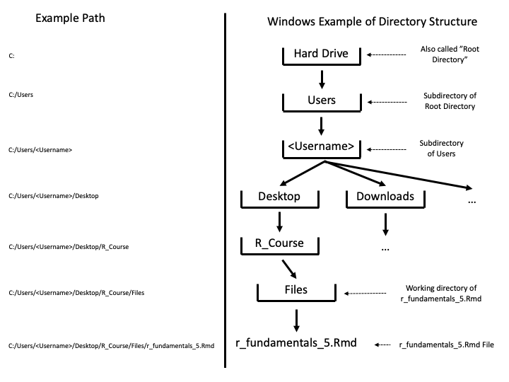

# Objective of workshop

To load and export data into and out of R, and start using RStudio projects to manage file paths. 

# What will this workshop cover?

In this workshop, the aim is to cover how to load and work with data frames, as well as an introduction to packages. We will be covering:

-   Introduction to packages
-   Introduction to directories and projects
-   Loading in data
-   Exporting data

------------------------------------------------------------------------

# Introduction to packages

Packages are collections of functions, code, and sample data put together by the R community. Packages are one of the main benefits of R. As R is open source there can be lots of contributors who have made functions to do complex tasks, such as data cleaning, specific types of data analysis, or exciting data visualisation.

To install these packages onto your computer you have to download them from CRAN (The Comprehensive R Archive Network).

{width="30%"}

There are two ways of doing this, using code (recommended and easiest) or using the menus (`Tools > Install Packages`).

Using code involves using the install packages function, which looks like: `install.packages("package name")`. To install the package you would type something like:`install.packages("readr")`.

Once installed, you will not need to do this again unless you install a newer version of R.

## Installing packages exercise

Try installing the following packages:`readr`, `readxl`, `writexl`, and `knitr` using the `install.packages()` function. We will be using these in today's session.


```r
# your code here
install.packages('readr')
install.packages('readxl')
install.packages('writexl')
install.packages('knitr')
```

# Loading packages

Now you have installed the packages, you need to load them in order to use them. **Each time you load R you will need to re-load the packages you want to use**.

To load a package you need to use the `library()` function. For example, if I wanted to load the `readr` package I would type `library(readr)`.

## Loading packages exercise

Using `library()` load in the packages you just installed: `readr`, `readxl`, and `writexl`.

*Note: readxl is the letter l rather than the number 1, which is hard to see with the default font*


```r
# your code here
library(readr)
library(readxl)
library(writexl)
```

If you are not sure what packages are loaded, you can use `sessionInfo()`. Run the code below to test it out. Under *other attached packages* you should see readr, readxl, and writexl.


```r
sessionInfo()
```

```
## R version 4.3.0 (2023-04-21)
## Platform: x86_64-apple-darwin20 (64-bit)
## Running under: macOS Ventura 13.5.1
## 
## Matrix products: default
## BLAS:   /Library/Frameworks/R.framework/Versions/4.3-x86_64/Resources/lib/libRblas.0.dylib 
## LAPACK: /Library/Frameworks/R.framework/Versions/4.3-x86_64/Resources/lib/libRlapack.dylib;  LAPACK version 3.11.0
## 
## locale:
## [1] en_US.UTF-8/en_US.UTF-8/en_US.UTF-8/C/en_US.UTF-8/en_US.UTF-8
## 
## time zone: Europe/London
## tzcode source: internal
## 
## attached base packages:
## [1] stats     graphics  grDevices utils     datasets  methods   base     
## 
## other attached packages:
## [1] writexl_1.4.2 readxl_1.4.2  readr_2.1.4  
## 
## loaded via a namespace (and not attached):
##  [1] vctrs_0.6.3      cli_3.6.1        knitr_1.43       rlang_1.1.1     
##  [5] xfun_0.39        jsonlite_1.8.7   glue_1.6.2       htmltools_0.5.5 
##  [9] sass_0.4.6       hms_1.1.3        fansi_1.0.4      rmarkdown_2.23  
## [13] cellranger_1.1.0 evaluate_0.21    jquerylib_0.1.4  tibble_3.2.1    
## [17] tzdb_0.4.0       fastmap_1.1.1    yaml_2.3.7       lifecycle_1.0.3 
## [21] compiler_4.3.0   pkgconfig_2.0.3  rstudioapi_0.14  digest_0.6.33   
## [25] R6_2.5.1         utf8_1.2.3       pillar_1.9.0     magrittr_2.0.3  
## [29] bslib_0.5.0      tools_4.3.0      cachem_1.0.8
```

# Introduction to directories

Before now you might have put your files in folders on the main screen (called desktop). This system has been designed by the creators of your computer to be visually intuitive for you but this is actually not how your computer sees where you place your files. In order to be able to interact with the files from inside your code you first have to understand how your computer finds where you placed a file.

Run the code below and read the output carefully.


```r
getwd()
```

```
## [1] "/Users/MOLES/Library/CloudStorage/OneDrive-LondonSchoolofEconomics/Code/rTrainIntroduction/r-fundamentals-5"
```

You should see a text divided with slashes  `/`. If you're on Windows it should start with `C:/Users/<your username>/...` while if you're on Mac you should see `/Users/<your username>/...`.

We call this a "path" and it tells you what directory the "r_fundamentals_5.Rmd" file is placed in. 

You can understand a directory as simply a place on your computer's hard drive and path as its' name. The simplest example of a directory is a folder. When you right click on your desktop and create a new folder, you create a new directory. Programmers often use the word folder interchangeably with a directory. Although they're almost the same in meaning a directory can also be a specific file in which case the path of a file will be the folder it is in followed by `/<name of the file>.<format such as jpg,txt or Rmd>`.

Note: On Windows the path returned in R will use `/` as the path separator. However, Windows machines use `\` as the path separator. 

## Finding your directory exercise

Now that you know the path of where your r_markdown file is, you can manually locate the file from the desktop.

If you're using Windows:

1. Copy the path you just found without the quotation marks (`shortcut: Ctrl+C`)
2. Minimize RStudio so that you're on your Desktop 
3. Open the Windows search menu and paste the path directly (`shortcut: Ctrl+V`)
4. Replace the forward slashes (`/`) with backward slashes (`\`)
5. Click on the folder that appears

If you're using Mac:

1. Copy the path you just found without the quotation marks (`shortcut: Command+C`)
2. Minimize RStudio so that you're on your Desktop
3. Open finder. It should be the most left file on your task bar on the bottom of the screen.
4. At the furthers top left of your screen, on the right side of an apple logo, you should click "Go"
5. From the drop down menu click "Go to folder..."
6. Paste the path there (`Command+V`) and double click the folder that appears.

You can verify visually that this folder has `r_fundamentals_5.Rmd` in it.

Once you have located the file manually please run this command.


```r
list.files()
```

```
## [1] "data"                            "images"                         
## [3] "r_fundamentals_5_solutions.html" "r_fundamentals_5_solutions.md"  
## [5] "r_fundamentals_5_solutions.Rmd"  "r_fundamentals_5.html"          
## [7] "r_fundamentals_5.md"             "r_fundamentals_5.Rmd"
```

This command will output all of the files contained in the directory you found by running `getwd()`. You can see `r_fundamentals_5.Rmd` as one of the files listed.

Now minimize RStudio again and go to the folder which you accessed previously, do all of the files match the output from `list.files()`?

## Loading in a Picture Exercise

1. Please download the picture "r_fundamentals_5.png" from the files in the r-fundamentals-5 teams channel
2. Create a new folder on your Desktop and move the picture to that new folder **Make sure it is a different folder than the one your `r_fundamentals_5.Rmd` is placed in**
3. Google how to find a path of a file on your operating system
4. Load in a picture using `knitr::include_graphics("path-to-image-here")` command. Note that if you are using Windows, make sure to change any backwards slashes (`\`) into forward slashes (`/`)
5. Feel free to inspect a picture to get a better understanding of how your computer memory is structured
6. Try running the same command but in the `path-to-image-here` insert just the name of the picture `r_fundamentals_5.png`. What error do you get? Why do you think that is?


```
## Error in knitr::include_graphics("e.g. C:/Users/<Your Name>/Desktop/New_file/r_fundamentals_5.png"): Cannot find the file(s): "e.g. C:/Users/<Your Name>/Desktop/New_file/r_fundamentals_5.png"
```

*note: include_graphics() command is from knitr package. You might have noticed that we have not loaded in knitr at the beginning of this lesson. We can actually use commands from packages you have installed but not loaded in using <name-of-the-package>::<command>. It's actually a good practice not to load in entire packages if we're only going to use a single command*

# Introduction to working directory

Congratulations, you now know how to find a path of any file on your computer and access it only using its' path.

In this lesson we will learn about two important directories. The working directory and subdirectory.

When starting this lesson you might have expected R to search your entire memory to find a file you are trying to load in. As the previous exercise has shown R has no ability to search through all the files on your computer to find the one you are looking for. This is why to load in a file you need to give it a precise location, the file path. Although R will cycle through your entire computer in search of a file there is one special directory in which it will look if you only give it a file name, the working directory. 

Working directory, as the name suggests, is a directory in which you are currently working. You should already know your working directory. The command `getwd()` actually stands for get working directory. If you place a file in a working directory you can access it just via its' name.

The second important directory is a subdirectory. The Oxford Language official definition of a subdirectory is "a directory below another directory in a hierarchy". If you create a folder inside your working directory, that folder will constitute a subdirectory of a working directory.

It's important to note that when loading in a file, R will not search through all of the subdirectories, only the working directory. Nonetheless, if you are putting a file in a subdirectory there is no need to spell out the entire file path. When we are looking for a file from a subdirectory of a working directory we can just spell out the file path from the working directory onwards. When telling R to find a file in a subdirectory, you need to reference working directory with a dot e.g. `./MyFolder/MyFile.txt` instead of `C:/Users/Desktop/MyWorkingDirectory/MyFolder/MyFile.txt`.

## Accessing a file from working directory exercise

1. Move your `r_fundamentals_5.png` file to your working directory *you can use `getwd()` again if you forgot where it is*
2. Run the command below without changing it. If the picture doesn't display correctly make sure you placed the picture in the same file you have `r_fundamentals_5.Rmd`.


```r
knitr::include_graphics("r_fundamentals_5.png")
```

```
## Error in knitr::include_graphics("r_fundamentals_5.png"): Cannot find the file(s): "r_fundamentals_5.png"
```

*You can see that if we have our file in a working directory there is no need to write out an entire path, we can just load a picture using its' name. This is actually true for all types of files, including datasets in .csv, such as the one you're going to load in at the end of this lesson.*

3. Run the command below


```r
# set up pathway
path <- "images"

# make data directory if it doesn't already exist in working directory
if (dir.exists(path) == FALSE) {
  dir.create(path)
}

# move image file if it exists in working directory
if (file.exists("r_fundamentals_5.png")) {
  file.rename(from = "r_fundamentals_5.png", to = file.path(path, "r_fundamentals_5.png"))
}
```

4. Inspect the working directory using `getwd()` and `list.files()`. What changed and where is the image now? Try running `list.files("images")` to help you


```r
# your code here

getwd()
```

```
## [1] "/Users/MOLES/Library/CloudStorage/OneDrive-LondonSchoolofEconomics/Code/rTrainIntroduction/r-fundamentals-5"
```

```r
list.files()
```

```
## [1] "data"                            "images"                         
## [3] "r_fundamentals_5_solutions.html" "r_fundamentals_5_solutions.md"  
## [5] "r_fundamentals_5_solutions.Rmd"  "r_fundamentals_5.html"          
## [7] "r_fundamentals_5.md"             "r_fundamentals_5.Rmd"
```

```r
list.files("images")
```

```
## [1] "fileSys.png"          "r_fundamentals_5.png" "RStudio_projects.png"
```


5. Modify the code below so that the picture displays correctly. *You don't need to spell out the entire path like in the `Loading in a Picture` exercise*


```r

```


**Note:** now that you know what a path is you can speed up your work by using keyboard shortcuts. To quickly get a file path you can click on the file once and press `Ctrl+Shift+C` or Right Click on the file and Copy as Path on Windows, or `Command+Option+C` on Mac. This will copy a path to your clipboard which you can then quickly paste with `Ctrl+V` on Windows and `Command+V` on Mac.

# How to set up a project?


1)  File `>` New Project...
2)  Select new directory (or existing directory if you have already set up a file)

**Setting up a project in a new directory:**

1)  Select new project
2)  Give your directory a name, e.g. "r-workshop"
3)  Select browse and find the directory you want to start your project
4)  Press Create Project
5)  Your new project should open

**Setting up a project in a existing directory:**

1)  Select browse and find the directory you want to start your project
2)  Press Create Project
3)  Your new project should open

To open and review your projects in future you will see them in a drop down menu in the top right corner of RStudio.

## Project exercise

*note: making a new project opens a new RStudio window, you can go back to your original window by selecting close project from the project drop down list in the top right corner.*

1)  Set up a project for this workshop using the steps above.
2)  Go to your newly created project folder in either File Explorer (Windows) or Finder (Mac).
3)  Put your r_fundamentals_5.Rmd file in your project directory (if you have not do so already).
4)  Add a new folder called data, and add in the data files for the session.
5)  Come back to RStudio and make sure you're project is open (*will see in top right corner your project name*), in the RStudio file explorer (bottom right) you should see the changes you've made.
6)  If you have not already, open the r_fundamentals_5.Rmd file.
7)  In the code chunk below run `getwd()`. You should get your new project file system as the output.


```r
# your code here
```

# Loading in data from your computer

Data can be loaded into R either from files from your computer, or the internet using URLs. R can handle many different file types thanks to packages built by the R community. These include .csv, .xlsx, .sav, .dta.

RStudio helpfully has auto-completion for directories to help you build file paths. To get this working use speech marks with a function, like `list.files()`. **Press tab (key on far left of keyboard above caps lock with arrow) when the cursor is within the speech marks (""). You should get a drop down list of your files, press tab again to select the file you want.** Repeat the process till you get to where you want to be.

## List files exercise

1)  Using speech marks and tab, as outlined above, list the files in your data file. You should get something like: `list.files("data/")`
2)  Run the code, the output should be the data files you put in the data file in step 4 of the project task.


```r
# your code here
list.files("data/")
```

```
## [1] "pokemonGen1.csv"            "pokemonGen1.xlsx"          
## [3] "pokemonGen2.csv"            "pokemonGen2.xlsx"          
## [5] "tfl-daily-cycle-hires.xlsx" "tfl-journeys-type.csv"     
## [7] "tflCycleHire_byMonth.xlsx"  "tflSubset.csv"             
## [9] "tflSubset.xlsx"
```

# Loading csv and Excel (.xlsx) files

Now you know how to access files, we can load them into R!

We are going to load in a .csv file and a .xlsx file, two of the most common file types to be loaded into R. To load data into R we use a read function.

First we will load a csv file. To load a csv we can use either `read.csv()` that comes with R by default, or we can use `read_csv()` that comes with the readr package. `read_csv()` is preferable as it loads in large datasets faster than `read.csv()`.

Just like making vectors or data frames in the previous workshops, you need to assign a name to your data that is being loaded. For example, if I was loading a dataset called *dataset.csv* stored in the data folder I would use: `data <- read_csv("data/dataset.csv")`.

## Loading csv files exercise

1)  Load in the *tfl-journeys-type.csv* using the `read_csv()` function from readr. Make sure to give the data a meaningful name, such as tflJourneyType.
2)  Get some information on your loaded data frame using functions such as `str()`, `head()`, or `summary()`.
3)  From the information, when does the dataset start and end recording data? *hint: head and tail functions will help*


```r
# make sure readr is loaded
library(readr)
# your code here
# load data
tflJourneyType <- read_csv("data/tfl-journeys-type.csv")
```

```
## Rows: 137 Columns: 12
## ── Column specification ────────────────────────────────────────────────────────
## Delimiter: ","
## chr (3): Period and Financial year, Period beginning, Period ending
## dbl (9): Reporting Period, Days in period, Bus journeys (m), Underground jou...
## 
## ℹ Use `spec()` to retrieve the full column specification for this data.
## ℹ Specify the column types or set `show_col_types = FALSE` to quiet this message.
```

```r
# get info
str(tflJourneyType)
```

```
## spc_tbl_ [137 × 12] (S3: spec_tbl_df/tbl_df/tbl/data.frame)
##  $ Period and Financial year    : chr [1:137] "01_10/11" "02_10/11" "03_10/11" "04_10/11" ...
##  $ Reporting Period             : num [1:137] 1 2 3 4 5 6 7 8 9 10 ...
##  $ Days in period               : num [1:137] 31 28 28 28 28 28 28 28 28 28 ...
##  $ Period beginning             : chr [1:137] "01-Apr-10" "02-May-10" "30-May-10" "27-Jun-10" ...
##  $ Period ending                : chr [1:137] "01-May-10" "29-May-10" "26-Jun-10" "24-Jul-10" ...
##  $ Bus journeys (m)             : num [1:137] 189 182 176 183 160 ...
##  $ Underground journeys (m)     : num [1:137] 90.5 84.5 84.3 86.5 82.9 80.9 88.7 90.3 90.6 72.5 ...
##  $ DLR Journeys (m)             : num [1:137] 6.3 5.8 5.8 6.1 5.8 5.5 6.3 6.7 6.4 4.8 ...
##  $ Tram Journeys (m)            : num [1:137] 2.3 2.2 2.1 2.1 2 2 2.3 2.2 2.3 1.8 ...
##  $ Overground Journeys (m)      : num [1:137] NA NA NA NA NA NA NA 5.6 5.4 3.5 ...
##  $ Emirates Airline Journeys (m): num [1:137] NA NA NA NA NA NA NA NA NA NA ...
##  $ TfL Rail Journeys (m)        : num [1:137] NA NA NA NA NA NA NA NA NA NA ...
##  - attr(*, "spec")=
##   .. cols(
##   ..   `Period and Financial year` = col_character(),
##   ..   `Reporting Period` = col_double(),
##   ..   `Days in period` = col_double(),
##   ..   `Period beginning` = col_character(),
##   ..   `Period ending` = col_character(),
##   ..   `Bus journeys (m)` = col_double(),
##   ..   `Underground journeys (m)` = col_double(),
##   ..   `DLR Journeys (m)` = col_double(),
##   ..   `Tram Journeys (m)` = col_double(),
##   ..   `Overground Journeys (m)` = col_double(),
##   ..   `Emirates Airline Journeys (m)` = col_double(),
##   ..   `TfL Rail Journeys (m)` = col_double()
##   .. )
##  - attr(*, "problems")=<externalptr>
```

```r
head(tflJourneyType)
```

```
## # A tibble: 6 × 12
##   Period and Financial …¹ `Reporting Period` `Days in period` `Period beginning`
##   <chr>                                <dbl>            <dbl> <chr>             
## 1 01_10/11                                 1               31 01-Apr-10         
## 2 02_10/11                                 2               28 02-May-10         
## 3 03_10/11                                 3               28 30-May-10         
## 4 04_10/11                                 4               28 27-Jun-10         
## 5 05_10/11                                 5               28 25-Jul-10         
## 6 06_10/11                                 6               28 22-Aug-10         
## # ℹ abbreviated name: ¹​`Period and Financial year`
## # ℹ 8 more variables: `Period ending` <chr>, `Bus journeys (m)` <dbl>,
## #   `Underground journeys (m)` <dbl>, `DLR Journeys (m)` <dbl>,
## #   `Tram Journeys (m)` <dbl>, `Overground Journeys (m)` <dbl>,
## #   `Emirates Airline Journeys (m)` <dbl>, `TfL Rail Journeys (m)` <dbl>
```

```r
tail(tflJourneyType)
```

```
## # A tibble: 6 × 12
##   Period and Financial …¹ `Reporting Period` `Days in period` `Period beginning`
##   <chr>                                <dbl>            <dbl> <chr>             
## 1 02_19/20                                 2               28 28-Apr-20         
## 2 03_19/20                                 3               28 26-May-20         
## 3 04_19/20                                 4               28 23-Jun-20         
## 4 05_19/20                                 5               28 21-Jul-20         
## 5 06_19/20                                 6               28 18-Aug-20         
## 6 07_19/20                                 7               28 15-Sep-20         
## # ℹ abbreviated name: ¹​`Period and Financial year`
## # ℹ 8 more variables: `Period ending` <chr>, `Bus journeys (m)` <dbl>,
## #   `Underground journeys (m)` <dbl>, `DLR Journeys (m)` <dbl>,
## #   `Tram Journeys (m)` <dbl>, `Overground Journeys (m)` <dbl>,
## #   `Emirates Airline Journeys (m)` <dbl>, `TfL Rail Journeys (m)` <dbl>
```

```r
summary(tflJourneyType)
```

```
##  Period and Financial year Reporting Period Days in period  Period beginning  
##  Length:137                Min.   : 1.000   Min.   :26.00   Length:137        
##  Class :character          1st Qu.: 4.000   1st Qu.:28.00   Class :character  
##  Mode  :character          Median : 7.000   Median :28.00   Mode  :character  
##                            Mean   : 6.847   Mean   :28.08                     
##                            3rd Qu.:10.000   3rd Qu.:28.00                     
##                            Max.   :13.000   Max.   :31.00                     
##                                                                               
##  Period ending      Bus journeys (m) Underground journeys (m) DLR Journeys (m)
##  Length:137         Min.   : 30.2    Min.   :  5.70           Min.   : 1.200  
##  Class :character   1st Qu.:166.3    1st Qu.: 90.50           1st Qu.: 7.000  
##  Mode  :character   Median :177.0    Median : 98.80           Median : 8.300  
##                     Mean   :170.4    Mean   : 95.15           Mean   : 7.982  
##                     3rd Qu.:185.2    3rd Qu.:106.10           3rd Qu.: 9.300  
##                     Max.   :207.5    Max.   :118.20           Max.   :10.600  
##                                                                               
##  Tram Journeys (m) Overground Journeys (m) Emirates Airline Journeys (m)
##  Min.   :0.400     Min.   : 1.000          Min.   :0.0000               
##  1st Qu.:2.100     1st Qu.: 9.225          1st Qu.:0.0800               
##  Median :2.200     Median :11.350          Median :0.1100               
##  Mean   :2.155     Mean   :11.543          Mean   :0.1124               
##  3rd Qu.:2.400     3rd Qu.:14.500          3rd Qu.:0.1300               
##  Max.   :2.800     Max.   :17.800          Max.   :0.5300               
##                    NA's   :7               NA's   :29                   
##  TfL Rail Journeys (m)
##  Min.   :0.600        
##  1st Qu.:3.400        
##  Median :3.700        
##  Mean   :3.692        
##  3rd Qu.:4.300        
##  Max.   :5.700        
##  NA's   :66
```

**Great work, you've loaded your first dataset!**

## Loading Excel (.xlsx) files exercise

Now lets have a go at reading data from an Excel file (.xlsx) using the tfl-daily-cycle-hires.xlsx file.

Excel files can come with multiple worksheets, such as the example we will use. To handle this the read_xlsx function has a sheet option. By default it will load sheet 1. For example, if I wanted to load in the third worksheet of an .xlsx file I would use: `data <- read_xlsx("data/datafile.xlsx", sheet = 3)`

1)  Using the `read_xlsx()` function, load worksheet 2 of the tfl-daily-cycle-hires.xlsx file, call your loaded data tflCycle.
2)  Get information on your data like you did for the csv task.
3)  Find out the mean, max, and min for the "Number of Bicycle Hires...2" column.

*note: we will tidy this dataframe up in the individual coding challenge*


```r
# make sure readxl is loaded
library(readxl)
# your code here
# load in data
tflCycle <- read_xlsx("data/tfl-daily-cycle-hires.xlsx", sheet = 2)
```

```
## New names:
## • `Number of Bicycle Hires` -> `Number of Bicycle Hires...2`
## • `` -> `...3`
## • `Month` -> `Month...4`
## • `Number of Bicycle Hires` -> `Number of Bicycle Hires...5`
## • `` -> `...6`
## • `Number of Bicycle Hires` -> `Number of Bicycle Hires...8`
## • `` -> `...9`
## • `Month` -> `Month...10`
```

```r
# get info
str(tflCycle)
```

```
## tibble [3,747 × 11] (S3: tbl_df/tbl/data.frame)
##  $ Day                        : POSIXct[1:3747], format: "2010-07-30" "2010-07-31" ...
##  $ Number of Bicycle Hires...2: num [1:3747] 6897 5564 4303 6642 7966 ...
##  $ ...3                       : logi [1:3747] NA NA NA NA NA NA ...
##  $ Month...4                  : POSIXct[1:3747], format: "2010-07-01" "2010-08-01" ...
##  $ Number of Bicycle Hires...5: num [1:3747] 12461 341203 540859 544412 456304 ...
##  $ ...6                       : logi [1:3747] NA NA NA NA NA NA ...
##  $ Year                       : chr [1:3747] "2010" "2011" "2012" "2013" ...
##  $ Number of Bicycle Hires...8: chr [1:3747] "2180813" "7142449" "9519283" "8045459" ...
##  $ ...9                       : logi [1:3747] NA NA NA NA NA NA ...
##  $ Month...10                 : POSIXct[1:3747], format: "2010-07-01" "2010-08-01" ...
##  $ Average Hire Time (mins)   : num [1:3747] 17.2 16.6 15.2 15.2 13.8 ...
```

```r
head(tflCycle)
```

```
## # A tibble: 6 × 11
##   Day                 `Number of Bicycle Hires...2` ...3  Month...4          
##   <dttm>                                      <dbl> <lgl> <dttm>             
## 1 2010-07-30 00:00:00                          6897 NA    2010-07-01 00:00:00
## 2 2010-07-31 00:00:00                          5564 NA    2010-08-01 00:00:00
## 3 2010-08-01 00:00:00                          4303 NA    2010-09-01 00:00:00
## 4 2010-08-02 00:00:00                          6642 NA    2010-10-01 00:00:00
## 5 2010-08-03 00:00:00                          7966 NA    2010-11-01 00:00:00
## 6 2010-08-04 00:00:00                          7893 NA    2010-12-01 00:00:00
## # ℹ 7 more variables: `Number of Bicycle Hires...5` <dbl>, ...6 <lgl>,
## #   Year <chr>, `Number of Bicycle Hires...8` <chr>, ...9 <lgl>,
## #   Month...10 <dttm>, `Average Hire Time (mins)` <dbl>
```

```r
summary(tflCycle)
```

```
##       Day                      Number of Bicycle Hires...2   ...3        
##  Min.   :2010-07-30 00:00:00   Min.   : 2764               Mode:logical  
##  1st Qu.:2013-02-20 12:00:00   1st Qu.:19217               NA's:3747     
##  Median :2015-09-15 00:00:00   Median :25909                             
##  Mean   :2015-09-15 00:00:00   Mean   :26049                             
##  3rd Qu.:2018-04-08 12:00:00   3rd Qu.:32944                             
##  Max.   :2020-10-31 00:00:00   Max.   :73094                             
##                                                                          
##    Month...4                      Number of Bicycle Hires...5   ...6        
##  Min.   :2010-07-01 00:00:00.00   Min.   :  12461             Mode:logical  
##  1st Qu.:2013-01-24 06:00:00.00   1st Qu.: 597528             NA's:3747     
##  Median :2015-08-16 12:00:00.00   Median : 753899                           
##  Mean   :2015-08-16 16:27:05.80   Mean   : 787153                           
##  3rd Qu.:2018-03-08 18:00:00.00   3rd Qu.: 995338                           
##  Max.   :2020-10-01 00:00:00.00   Max.   :1253102                           
##  NA's   :3623                     NA's   :3623                              
##      Year           Number of Bicycle Hires...8   ...9        
##  Length:3747        Length:3747                 Mode:logical  
##  Class :character   Class :character            NA's:3747     
##  Mode  :character   Mode  :character                          
##                                                               
##                                                               
##                                                               
##                                                               
##    Month...10                     Average Hire Time (mins)
##  Min.   :2010-07-01 00:00:00.00   Min.   :13.78           
##  1st Qu.:2013-01-24 06:00:00.00   1st Qu.:16.82           
##  Median :2015-08-16 12:00:00.00   Median :18.70           
##  Mean   :2015-08-16 16:27:05.80   Mean   :19.27           
##  3rd Qu.:2018-03-08 18:00:00.00   3rd Qu.:21.02           
##  Max.   :2020-10-01 00:00:00.00   Max.   :36.00           
##  NA's   :3623                     NA's   :3623
```

```r
# mean, max, min
mean(tflCycle$`Number of Bicycle Hires...2`)
```

```
## [1] 26049.36
```

```r
min(tflCycle$`Number of Bicycle Hires...2`)
```

```
## [1] 2764
```

```r
max(tflCycle$`Number of Bicycle Hires...2`)
```

```
## [1] 73094
```

# Loading in data from the internet

Loading data from the internet can be useful for datasets that regularly update, such as the tfl dataset we loaded earlier. By using the URL for the dataset, we don't need to regularly download and store the data on our computer.

We load the data in a very similar way to how we load in files from our computer, but instead of giving the file path, we give the URL to where the raw data is stored online. For example, we would write something like: `data <- read_csv("link to data")`.

## Loading data from the internet exercise

1)  Go to the following website: <https://data.london.gov.uk/dataset/public-transport-journeys-type-transport>
2)  Find the csv file (yellow colour with around 8 or 9 kB). Use the download drop down menu and copy the *'copy link to file'* link provided.
3)  Using `read_csv()`, load in the data using the link you just copied. Call it `tflJourneyType` again.
4)  Run commands such as `str()` and `summary()` to make sure the data has loaded correctly.


```r
# your code here
# loading data
tflJourneyType <- read_csv("https://data.london.gov.uk/download/public-transport-journeys-type-transport/06a805f6-77c6-481a-8b08-ddef56afffdd/tfl-journeys-type.csv")
```

```
## Rows: 173 Columns: 12
## ── Column specification ────────────────────────────────────────────────────────
## Delimiter: ","
## chr (3): Period and Financial year, Period beginning, Period ending
## dbl (9): Reporting Period, Days in period, Bus journeys (m), Underground jou...
## 
## ℹ Use `spec()` to retrieve the full column specification for this data.
## ℹ Specify the column types or set `show_col_types = FALSE` to quiet this message.
```

```r
# get info
str(tflJourneyType)
```

```
## spc_tbl_ [173 × 12] (S3: spec_tbl_df/tbl_df/tbl/data.frame)
##  $ Period and Financial year    : chr [1:173] "01_10/11" "02_10/11" "03_10/11" "04_10/11" ...
##  $ Reporting Period             : num [1:173] 1 2 3 4 5 6 7 8 9 10 ...
##  $ Days in period               : num [1:173] 31 28 28 28 28 28 28 28 28 28 ...
##  $ Period beginning             : chr [1:173] "01-Apr-10" "02-May-10" "30-May-10" "27-Jun-10" ...
##  $ Period ending                : chr [1:173] "01-May-10" "29-May-10" "26-Jun-10" "24-Jul-10" ...
##  $ Bus journeys (m)             : num [1:173] 189 182 176 183 160 ...
##  $ Underground journeys (m)     : num [1:173] 90.5 84.5 84.3 86.5 82.9 80.9 88.7 90.3 90.6 72.5 ...
##  $ DLR Journeys (m)             : num [1:173] 6.3 5.8 5.8 6.1 5.8 5.5 6.3 6.7 6.4 4.8 ...
##  $ Tram Journeys (m)            : num [1:173] 2.3 2.2 2.1 2.1 2 2 2.3 2.2 2.3 1.8 ...
##  $ Overground Journeys (m)      : num [1:173] NA NA NA NA NA NA NA 5.6 5.4 3.5 ...
##  $ London Cable Car Journeys (m): num [1:173] NA NA NA NA NA NA NA NA NA NA ...
##  $ TfL Rail Journeys (m)        : num [1:173] NA NA NA NA NA NA NA NA NA NA ...
##  - attr(*, "spec")=
##   .. cols(
##   ..   `Period and Financial year` = col_character(),
##   ..   `Reporting Period` = col_double(),
##   ..   `Days in period` = col_double(),
##   ..   `Period beginning` = col_character(),
##   ..   `Period ending` = col_character(),
##   ..   `Bus journeys (m)` = col_double(),
##   ..   `Underground journeys (m)` = col_double(),
##   ..   `DLR Journeys (m)` = col_double(),
##   ..   `Tram Journeys (m)` = col_double(),
##   ..   `Overground Journeys (m)` = col_double(),
##   ..   `London Cable Car Journeys (m)` = col_double(),
##   ..   `TfL Rail Journeys (m)` = col_double()
##   .. )
##  - attr(*, "problems")=<externalptr>
```

```r
summary(tflJourneyType)
```

```
##  Period and Financial year Reporting Period Days in period  Period beginning  
##  Length:173                Min.   : 1.000   Min.   :26.00   Length:173        
##  Class :character          1st Qu.: 4.000   1st Qu.:28.00   Class :character  
##  Mode  :character          Median : 7.000   Median :28.00   Mode  :character  
##                            Mean   : 6.896   Mean   :28.09                     
##                            3rd Qu.:10.000   3rd Qu.:28.00                     
##                            Max.   :13.000   Max.   :31.00                     
##                                                                               
##  Period ending      Bus journeys (m) Underground journeys (m) DLR Journeys (m)
##  Length:173         Min.   : 30.2    Min.   :  5.70           Min.   : 1.200  
##  Class :character   1st Qu.:145.8    1st Qu.: 84.50           1st Qu.: 6.500  
##  Mode  :character   Median :173.9    Median : 94.30           Median : 7.700  
##                     Mean   :159.6    Mean   : 88.76           Mean   : 7.599  
##                     3rd Qu.:182.7    3rd Qu.:105.30           3rd Qu.: 9.200  
##                     Max.   :207.5    Max.   :118.20           Max.   :10.600  
##                                                                               
##  Tram Journeys (m) Overground Journeys (m) London Cable Car Journeys (m)
##  Min.   :0.400     Min.   : 1.00           Min.   :0.0000               
##  1st Qu.:1.800     1st Qu.: 8.90           1st Qu.:0.1000               
##  Median :2.200     Median :11.35           Median :0.1000               
##  Mean   :2.005     Mean   :11.30           Mean   :0.1097               
##  3rd Qu.:2.300     3rd Qu.:14.30           3rd Qu.:0.1000               
##  Max.   :2.800     Max.   :17.80           Max.   :0.5000               
##                    NA's   :7               NA's   :29                   
##  TfL Rail Journeys (m)
##  Min.   : 0.600       
##  1st Qu.: 3.200       
##  Median : 3.700       
##  Mean   : 4.762       
##  3rd Qu.: 4.500       
##  Max.   :16.700       
##  NA's   :66
```

# Exporting data

You've learned how to load in data from computer files and the internet, now lets save some data. We will have a go at writing to both csv and xlsx (using `writexl`). The concept is very much the same as reading in data. We provide the write function with our data, then give it a file path and file name.

For example, if I wanted to save a csv file to my data folder: `write_csv(data, "data/data.csv")`.

## Exporting data exercise

Using the tflJourneyType dataset follow the steps:

1)  First lets do some calculations. Make a new column called BusTube that is the sum of bus journeys and tube journeys, for example `data$newcol <- data$col1 + data$col2`.
2)  Make another new column called DLR_Tram that is the sum of DLR journeys and Tram journeys.
3)  Make a new dataset called tflSubset that contains the first column, and both your new columns (BusTube & DLR_Tram) *hint: use indexing [ , ]*
4)  Using `write_csv()` write your tflSubset data to your data file. Call it tflSubset.csv.
5)  Using `write_xlsx()` write your tflSubset data to your data file. Call it tflSubset.xlsx.
6)  Have a look at the csv and xlsx files you have created in finder or windows explorer.


```r
# make sure writexl is loaded
library(writexl)
# your code here
# adding calculation cols
tflJourneyType$BusTube <- tflJourneyType$`Bus journeys (m)` + tflJourneyType$`Underground journeys (m)`
tflJourneyType$DLR_Tram <- tflJourneyType$`DLR Journeys (m)`+ tflJourneyType$`Tram Journeys (m)`
# subset to new dataset
str(tflJourneyType)
```

```
## spc_tbl_ [173 × 14] (S3: spec_tbl_df/tbl_df/tbl/data.frame)
##  $ Period and Financial year    : chr [1:173] "01_10/11" "02_10/11" "03_10/11" "04_10/11" ...
##  $ Reporting Period             : num [1:173] 1 2 3 4 5 6 7 8 9 10 ...
##  $ Days in period               : num [1:173] 31 28 28 28 28 28 28 28 28 28 ...
##  $ Period beginning             : chr [1:173] "01-Apr-10" "02-May-10" "30-May-10" "27-Jun-10" ...
##  $ Period ending                : chr [1:173] "01-May-10" "29-May-10" "26-Jun-10" "24-Jul-10" ...
##  $ Bus journeys (m)             : num [1:173] 189 182 176 183 160 ...
##  $ Underground journeys (m)     : num [1:173] 90.5 84.5 84.3 86.5 82.9 80.9 88.7 90.3 90.6 72.5 ...
##  $ DLR Journeys (m)             : num [1:173] 6.3 5.8 5.8 6.1 5.8 5.5 6.3 6.7 6.4 4.8 ...
##  $ Tram Journeys (m)            : num [1:173] 2.3 2.2 2.1 2.1 2 2 2.3 2.2 2.3 1.8 ...
##  $ Overground Journeys (m)      : num [1:173] NA NA NA NA NA NA NA 5.6 5.4 3.5 ...
##  $ London Cable Car Journeys (m): num [1:173] NA NA NA NA NA NA NA NA NA NA ...
##  $ TfL Rail Journeys (m)        : num [1:173] NA NA NA NA NA NA NA NA NA NA ...
##  $ BusTube                      : num [1:173] 280 266 260 270 243 ...
##  $ DLR_Tram                     : num [1:173] 8.6 8 7.9 8.2 7.8 7.5 8.6 8.9 8.7 6.6 ...
##  - attr(*, "spec")=
##   .. cols(
##   ..   `Period and Financial year` = col_character(),
##   ..   `Reporting Period` = col_double(),
##   ..   `Days in period` = col_double(),
##   ..   `Period beginning` = col_character(),
##   ..   `Period ending` = col_character(),
##   ..   `Bus journeys (m)` = col_double(),
##   ..   `Underground journeys (m)` = col_double(),
##   ..   `DLR Journeys (m)` = col_double(),
##   ..   `Tram Journeys (m)` = col_double(),
##   ..   `Overground Journeys (m)` = col_double(),
##   ..   `London Cable Car Journeys (m)` = col_double(),
##   ..   `TfL Rail Journeys (m)` = col_double()
##   .. )
##  - attr(*, "problems")=<externalptr>
```

```r
tflSubset <- tflJourneyType[,c('Period and Financial year','BusTube','DLR_Tram')]
# write to csv
write_csv(tflSubset, "data/tflSubset.csv")
# write to xlsx
write_xlsx(tflSubset, "data/tflSubset.xlsx")
```

# Final task - Please give us your individual feedback!

We would be grateful if you could take a minute before the end of the workshop so we can get your feedback!

<https://lse.eu.qualtrics.com/jfe/form/SV_ewXuHQ1nRnurTdY?coursename=R%Fundamentals%5:%Loading%data%and%packages&topic=R&prog=DS&version=22-23&link=https://lsecloud.sharepoint.com/:f:/s/TEAM_APD-DSL-Digital-Skills-Trainers/Enb32qhTgaZNrj--DH48fLcBMXQZrXgpjtfW2dawAVYhBQ?e=RrIyhO>

# Individual take home challenge

In this coding challenge you will need to re-organise the code to get it to run. The tfl cycles dataset is a bit messy, the first two columns are the raw data, the rest is aggregated data. We are going to separate it out into separate data frames to make it easier to read. Then write out the most interesting data.

You should end up with an output of *"The highest highest average cycle hire time per month was 36 minutes, on the 2020-04-01 with total hires of 591058 which is just after lockdown started!"*, and the by month xlsx file in your data file.

*note: you might need to change the file paths to match your system*


```r
# Take out raw data (hire by day)
tflCycleByDay <- tflCycle[,1:2]

# most popular day, months and year
maxDay <- tflCycleByDay[which.max(tflCycleByDay$`Number of Bicycle Hires...2`),]
maxMonth <- tflCycleByMonth[which.max(tflCycleByMonth$`Number of Bicycle Hires...5`),]
```

```
## Error in eval(expr, envir, enclos): object 'tflCycleByMonth' not found
```

```r
maxHire <- tflCycleByMonth[which.max(tflCycleByMonth$`Average Hire Time (mins)`),]
```

```
## Error in eval(expr, envir, enclos): object 'tflCycleByMonth' not found
```

```r
maxYear <- tflCycleByYear[which.max(tflCycleByYear$`Number of Bicycle Hires...8`),]
```

```
## Error in eval(expr, envir, enclos): object 'tflCycleByYear' not found
```

```r
# load in tfl cycle data (might need to change file path)
tflCycle <- read_xlsx("data/tfl-daily-cycle-hires.xlsx", sheet = 2) 
```

```
## New names:
## • `Number of Bicycle Hires` -> `Number of Bicycle Hires...2`
## • `` -> `...3`
## • `Month` -> `Month...4`
## • `Number of Bicycle Hires` -> `Number of Bicycle Hires...5`
## • `` -> `...6`
## • `Number of Bicycle Hires` -> `Number of Bicycle Hires...8`
## • `` -> `...9`
## • `Month` -> `Month...10`
```

```r
# hire by month and ave hire time
tflCycleByMonth <- tflCycle[,c("Month...4","Number of Bicycle Hires...5","Average Hire Time (mins)")]

# making month a character for paste
maxHire$Month...4 <- as.character(maxHire$Month...4)
```

```
## Error in eval(expr, envir, enclos): object 'maxHire' not found
```

```r
# pasting an output
paste("The highest highest average cycle hire time per month was", maxHire[1,3], 
      "minutes, on the", maxHire[1,1],"with total hires of", maxHire[1,2],
      "which is just after lockdown started!")
```

```
## Error in eval(expr, envir, enclos): object 'maxHire' not found
```

```r
# hire by year
tflCycleByYear <- tflCycle[1:10,c("Year", "Number of Bicycle Hires...8")]

# write the tfl cycle by month data (most interesting)
write_xlsx(tflCycleByMonth, "data/tflCycleHire_byMonth.xlsx")

# load libraries
library(readxl)
library(writexl)
```


```r
# solution!
# load libraries
library(readxl)
library(writexl)

# load in tfl cycle data (might need to change file path)
tflCycle <- read_xlsx("data/tfl-daily-cycle-hires.xlsx", sheet = 2) 
```

```
## New names:
## • `Number of Bicycle Hires` -> `Number of Bicycle Hires...2`
## • `` -> `...3`
## • `Month` -> `Month...4`
## • `Number of Bicycle Hires` -> `Number of Bicycle Hires...5`
## • `` -> `...6`
## • `Number of Bicycle Hires` -> `Number of Bicycle Hires...8`
## • `` -> `...9`
## • `Month` -> `Month...10`
```

```r
# Take out raw data (hire by day)
tflCycleByDay <- tflCycle[,1:2]

# hire by month and ave hire time
tflCycleByMonth <- tflCycle[,c("Month...4","Number of Bicycle Hires...5","Average Hire Time (mins)")]

# hire by year
tflCycleByYear <- tflCycle[1:10,c("Year", "Number of Bicycle Hires...8")]

# most popular day, months and year
maxDay <- tflCycleByDay[which.max(tflCycleByDay$`Number of Bicycle Hires...2`),]
maxMonth <- tflCycleByMonth[which.max(tflCycleByMonth$`Number of Bicycle Hires...5`),]
maxHire <- tflCycleByMonth[which.max(tflCycleByMonth$`Average Hire Time (mins)`),]
maxYear <- tflCycleByYear[which.max(tflCycleByYear$`Number of Bicycle Hires...8`),]

# making month a character for paste
maxHire$Month...4 <- as.character(maxHire$Month...4)

# pasting an output
paste("The highest highest average cycle hire time per month was", maxHire[1,3], 
      "minutes, on the", maxHire[1,1],"with total hires of", maxHire[1,2],
      "which is just after lockdown started!")
```

```
## [1] "The highest highest average cycle hire time per month was 36 minutes, on the 2020-04-01 with total hires of 591058 which is just after lockdown started!"
```

```r
# write the tfl cycle by month data (most interesting)
write_xlsx(tflCycleByMonth, "data/tflCycleHire_byMonth.xlsx")
```

# Other options for loading data

It is useful to mention the `data.table` package, which is the fastest option when loading large csv files by using the `fread()` function.


# Individual take home challenge: Modyfing directories

Before now, you probably have moved your files around your computer using your mouse (we call it `drag and drop`). Although this is more than enough in day to day tasks, programmers usually opt for creating and moving files from inside the code. Why? Imagine that you are working in a project, with multiple other analysts, where you are using +100 datasets. Firstly, such large data bases would probably be divided into different folders so that data is easier to find. If you were to load/save and move your files using drag and drop, what would happen if your colleague asks you to send them their work. You would most likely have send them list of instructions of which of the 100 datasets to load in and what variable names to give it so that your code runs smoothly. Lot's of unnecessary additional work. This is why in larger coding projects it's a good practice to have a standard layout and only load/save/move around files from inside the code.

In the previous exercise you manually wrote out a path to the file using slashes `/`. As you might be wondering, there is a quicker way of concatenating (chaining) different file paths, without the need to spell out slashes `/`. We do this with a `file.path(<path1>,<path2>,<path3>,...)`. Below is a quick example of how we can use `file.path()` to get an entire path of a file you have loaded in the previously. You can see that we can even chain it with commands like `getwd()`, variables, and spelling out a name manually. This can be especially helpful if you expect someone else using your code on their personal device, as their working directory will differ from yours.


```r
file.path(getwd(),path,"r_fundamentals_5.png")
```

```
## [1] "/Users/MOLES/Library/CloudStorage/OneDrive-LondonSchoolofEconomics/Code/rTrainIntroduction/r-fundamentals-5/images/r_fundamentals_5.png"
```

With `dir.create(<new folder path>)` we can create new folder. With the `recursive = TRUE` argument we can actually create more than one folder at a time. The command below will create an empty `new_folder` in your working directory and then create another folder inside that folder.

Run the below command and inspect your working directory visually.


```r
new_folder_path <- file.path(getwd(),"new_folder","folder_inside_a_folder")
dir.create(new_folder_path,recursive=TRUE)
```

*note: if you re-run the above command you will get a Warning that the folder you're trying to create already exists. This is why we often combine commands for creating folders with an if statements to prevent trying to create a folder if it already exists. You can check whether a folder exists using dir.exists(<path of a folder>) and whether a file exists using file.exists(<path to a file>)*

Just like we can create new folders from inside the code we can also remove them easily. Run the command below to delete empty folder we have just created:


```r
file.remove(new_folder_path)
```

```
## [1] TRUE
```

```r
file.remove(file.path(getwd(),"new_folder"))
```

```
## [1] TRUE
```

**IMPORTANT WARNING: Make sure you check trice before deleting anything from inside the code as unlike deleting with a mouse cursor, deleted files DO NOT land in the bin. Additionally, if you ever search online for deleting files, you might stumble upon `unlink(<directory>,recursive=TRUE)` command. Unlike file.remove() unlink will not return a warning when a folder is not empty but will instead delete everything inside it. If you set an argument force=TRUE, you can even make it delete the R markdown file you are using. For this very reason we advice against ever using unlink(), and instead taking time to remove files one by one. On this very rare exception, more code is better.**


## Copying a file exercise

As you might have seen from the previous exercise we can move any file using `file.rename(from = <current path>,to = <target file path>)`. Similarly, we can also copy files from inside R. The command `file.copy(from = <current path>,to = <target file path>)` is used for copying files and is used in the same way `file.rename()` would be.

Fill in the code below to copy our image `r_fundamentals_5.png` to a new folder with the name of your choosing. Try avoiding spelling out the path manually, but instead use `file.path()` commands where necessary:


```r
# set up pathways
old_folder <- "images"
image_name <- "r_fundamentals_5.png"
new_folder <- "image_copy"


# make a new directory if it doesn't already exist in a working directory
if (dir.exists(new_folder) == FALSE) {
  dir.create(new_folder)
}


# copy image file if it exists in working directory
if (file.exists(file.path(old_folder,image_name)) & file.exists(file.path(new_folder))) {
  file.copy(from = file.path(old_folder,image_name), to = file.path(new_folder, image_name))
}
```


