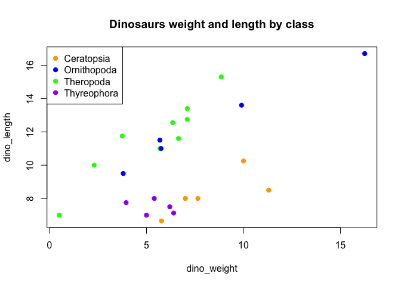

# What this workshop will cover

-   What a matrix is and how to use it
-   Using a matrix for calculations
-   What a list is and how to use it
-   How to work with list of lists
-   Converting lists and matrices to other data types

## Why this style?

-   Online training is tiring so keeping the sessions to one hour
-   No or limited demonstrations provided in order to provide more real world experience - you have a problem and you look up how to solve it, adapting example code
-   Trainer support to guide through process of learning

## We will be working in pairs:

-   Option to work together on worksheet or to work individually
-   If possible have your camera on and introduce yourself to each other

## What to do when getting stuck:

1)  Ask your team members
2)  Search online:

-   The answer box on the top of Google's results page
-   stackoverflow.com (for task-specific solutions)
-   <https://www.r-bloggers.com/> (topic based tutorials)

3)  Don't struggle too long looking online, ask the trainer if you can't find a solution!

------------------------------------------------------------------------

# Introduction to matrices

A matrix is a two dimensional data structure that is organised in a tabular layout, very similar to a data frame.

{width="500"}

What is the difference between a matrix and a data frame? Matrices can have only **one data type**, whereas a data frame can have several so long as they are in separate columns. If you have come from Python, this is similar to a NumPy array.

To make a matrix in R we use the `matrix()` function, see the two examples below on how to make a simple one dimensional matrix.


```r
# a matrix with 1:10
matrix(1:10)
```

```
##       [,1]
##  [1,]    1
##  [2,]    2
##  [3,]    3
##  [4,]    4
##  [5,]    5
##  [6,]    6
##  [7,]    7
##  [8,]    8
##  [9,]    9
## [10,]   10
```

```r
# matrix with strings
matrix(c("dog", "cat", "fish", "bird"))
```

```
##      [,1]  
## [1,] "dog" 
## [2,] "cat" 
## [3,] "fish"
## [4,] "bird"
```

How do we make the matrices two dimensional? We have to add arguments to the matrix function. These are `nrow` and `ncol`. We use these to tell R how many rows or columns we want our matrix to have.


```r
# matrix with 5 rows
matrix(1:10, nrow = 5)
```

```
##      [,1] [,2]
## [1,]    1    6
## [2,]    2    7
## [3,]    3    8
## [4,]    4    9
## [5,]    5   10
```

```r
matrix(1:10, ncol = 2)
```

```
##      [,1] [,2]
## [1,]    1    6
## [2,]    2    7
## [3,]    3    8
## [4,]    4    9
## [5,]    5   10
```

```r
# matrix with 5 cols
matrix(1:10, ncol = 5)
```

```
##      [,1] [,2] [,3] [,4] [,5]
## [1,]    1    3    5    7    9
## [2,]    2    4    6    8   10
```

```r
matrix(1:10, nrow = 2)
```

```
##      [,1] [,2] [,3] [,4] [,5]
## [1,]    1    3    5    7    9
## [2,]    2    4    6    8   10
```

You may have noticed that by default the matrix is filled by columns. In our example with 5 rows, the first column would be 1 to 5, and the second 6 to 10. We can change this behaviour to make the matrix be filled by rows. We use the `byrow` argument for this.


```r
# fill by row with 5 cols
matrix(1:10, ncol = 5, byrow = TRUE)
```

```
##      [,1] [,2] [,3] [,4] [,5]
## [1,]    1    2    3    4    5
## [2,]    6    7    8    9   10
```

```r
# fill by row with 5 rows
matrix(1:10, nrow = 5, byrow = TRUE)
```

```
##      [,1] [,2]
## [1,]    1    2
## [2,]    3    4
## [3,]    5    6
## [4,]    7    8
## [5,]    9   10
```

We can also add row and column names to make our data easier to read and use. There are two options for this, which are shown in the example below. The first uses the `dimnames` argument, the second uses the `colnames` and `rownames` functions.


```r
# name rows and columns with dimnames
matrix(1:10, nrow = 5, byrow = TRUE,
       dimnames = list(c("row_a", "row_b", "row_c", "row_d", "row_e"),
                       c("col_a", "col_b")))
```

```
##       col_a col_b
## row_a     1     2
## row_b     3     4
## row_c     5     6
## row_d     7     8
## row_e     9    10
```

```r
# using colnames and rownames functions
mat <- matrix(1:10, nrow = 5, byrow = TRUE)

colnames(mat) <- c("col_a", "col_b")
rownames(mat) <- c("row_a", "row_b", "row_c", "row_d", "row_e")

mat
```

```
##       col_a col_b
## row_a     1     2
## row_b     3     4
## row_c     5     6
## row_d     7     8
## row_e     9    10
```

To index your matrix, we use square brackets (`[]`), just like a data frame. Remember that we separate the square brackets with a comma, with the first section being row index and second section the column index: `matrix[row_index, col_index]`


```r
# first row, all columns
mat[1, ]
```

```
## col_a col_b 
##     1     2
```

```r
# first col, all rows
mat[, 1]
```

```
## row_a row_b row_c row_d row_e 
##     1     3     5     7     9
```

```r
# first and last row, all cols
mat[c(1, 5), ]
```

```
##       col_a col_b
## row_a     1     2
## row_e     9    10
```

```r
# first three rows
mat[1:3, ]
```

```
##       col_a col_b
## row_a     1     2
## row_b     3     4
## row_c     5     6
```

As we have a matrix with named rows and columns, we can use them to index with instead of numbers.


```r
# first column, all rows
mat[, "col_a"]
```

```
## row_a row_b row_c row_d row_e 
##     1     3     5     7     9
```

```r
# first row, all cols
mat["row_a", ]
```

```
## col_a col_b 
##     1     2
```

```r
# all cols, row a and e
mat[c("row_a", "row_e"), ]
```

```
##       col_a col_b
## row_a     1     2
## row_e     9    10
```

Finally, we can use the indexing to perform calculations on elements of the matrix.


```r
# sum the first col
sum(mat[, 2])
```

```
## [1] 30
```

```r
# sum second col
sum(mat[, 1])
```

```
## [1] 25
```

```r
# sum both cols
sum(mat)
```

```
## [1] 55
```

When summing the whole matrix, this is done *columnwise*, this means that the sum of column 1 is added to the sum of column 2.

## Intro to matricies exercise

Using the `dat` vector provided, try the following exercises:

1)  make a matrix called my_mat with three columns, print the outcome to view your matrix
2)  change the column and row names of your matrix. Your column names should be col_1, col_2 etc. and your row names should be row_1, row_2 etc. *hint: this can be automated by using paste and seq functions: paste0("text", seq(1:5)*
3)  Print your matrix again to see your new col and row names
4)  Calculate the mean of all the values in your matrix, watch out for the NA value!
5)  Find the mean of the third column of your matrix
6)  Find the mean of the first 5 rows, and first two columns of your matrix.


```r
# data to use in the matrix
dat <- sample(c(1:29, NA), 30)

# your code here
# make matrix with 3 cols
my_mat <- matrix(dat, ncol = 3)
my_mat
```

```
##       [,1] [,2] [,3]
##  [1,]   29   19    9
##  [2,]    6    2   10
##  [3,]   11   21   23
##  [4,]   24   16   27
##  [5,]   18   17   20
##  [6,]    7   25   22
##  [7,]   26   28   14
##  [8,]   15    8    1
##  [9,]   NA   13    4
## [10,]    3   12    5
```

```r
# change col and row names
colnames(my_mat) <- paste0("col_", seq(1:3))
rownames(my_mat) <- paste0("row_", seq(1:10))

my_mat
```

```
##        col_1 col_2 col_3
## row_1     29    19     9
## row_2      6     2    10
## row_3     11    21    23
## row_4     24    16    27
## row_5     18    17    20
## row_6      7    25    22
## row_7     26    28    14
## row_8     15     8     1
## row_9     NA    13     4
## row_10     3    12     5
```

```r
# calculate mean of whole matrix
mean(my_mat, na.rm = TRUE)
```

```
## [1] 15
```

```r
# mean of col_3
mean(my_mat[, "col_3"], na.rm = TRUE)
```

```
## [1] 13.5
```

```r
# mean of specific cols and rows with paste
paste("The mean of the first 5 rows, and col 1 and 2 is:", mean(my_mat[5, 1:2], na.rm = TRUE))
```

```
## [1] "The mean of the first 5 rows, and col 1 and 2 is: 17.5"
```

# Converting data into and from matricies

When doing analysis with R, you sometimes come across analysis packages that require your data to be in the form of a matrix. How do you convert your data from an object like a data frame to a matrix?

The first thing is to make sure you don't have any string (or character) data. If you do, you will have to remove it, or use it as a row index.

If the string data isn't removed, all elements of your matrix will become string which isn't ideal!


```r
# make a data frame with some random data
df <- data.frame(
  string = paste0("string", seq(1:10)),
  int = 1:10,
  samp = sample(1:20, 10),
  rand = runif(10, min = 1, max = 10),
  rand2 = rnorm(10, mean = 5, sd = 2)
)

# our col string is a character type
str(df)
```

```
## 'data.frame':	10 obs. of  5 variables:
##  $ string: chr  "string1" "string2" "string3" "string4" ...
##  $ int   : int  1 2 3 4 5 6 7 8 9 10
##  $ samp  : int  5 16 19 3 12 4 7 10 2 11
##  $ rand  : num  6.56 9.81 3.12 2.97 6.48 ...
##  $ rand2 : num  4.67 3.19 4.8 5.62 2.66 ...
```

As you can see we have a character variable, but we can move it to become a row name which can make indexing specific rows easier.


```r
# make string a row name (or index)
rownames(df) <- df$string

# remove column using conditional logic
rem_col <- "string"
df <- df[, !colnames(df) %in% rem_col]

# review the output
head(df)
```

```
##         int samp     rand    rand2
## string1   1    5 6.559507 4.665950
## string2   2   16 9.812655 3.186029
## string3   3   19 3.121976 4.801341
## string4   4    3 2.965566 5.622138
## string5   5   12 6.483855 2.656978
## string6   6    4 5.258851 3.735684
```

Note that this is made a bit easier with the tidyverse. We can use the tibble package with the function `column_to_rownames()`, which in this example would like like `tibble::column_to_rownames(df, var = "string")`.

To convert our data frame to a matrix, we use the `as.matrix()` function. By naming the columns and rows, it is easier to read once converted.


```r
# convert to matrix
df_mat <- as.matrix(df)
head(df_mat)
```

```
##         int samp     rand    rand2
## string1   1    5 6.559507 4.665950
## string2   2   16 9.812655 3.186029
## string3   3   19 3.121976 4.801341
## string4   4    3 2.965566 5.622138
## string5   5   12 6.483855 2.656978
## string6   6    4 5.258851 3.735684
```

```r
# check the class
class(df_mat)
```

```
## [1] "matrix" "array"
```

We can do calculations on matrix elements and add them to the matrix using `cbind` or `rbind`. In the example, we will do a calculation on two columns, then use cbind to add that column to the matrix. Notice how this is slightly more difficult that doing similar with a data frame.


```r
# make vector with calculation
calc <- (df_mat[, "samp"] * df_mat[, "rand"])/100
calc
```

```
##    string1    string2    string3    string4    string5    string6    string7 
## 0.32797536 1.57002480 0.59317548 0.08896697 0.77806262 0.21035403 0.56196142 
##    string8    string9   string10 
## 0.13735939 0.03066345 1.04735709
```

```r
# add to matrix as column
df_mat <- cbind(df_mat, calc)
df_mat
```

```
##          int samp     rand     rand2       calc
## string1    1    5 6.559507 4.6659496 0.32797536
## string2    2   16 9.812655 3.1860290 1.57002480
## string3    3   19 3.121976 4.8013414 0.59317548
## string4    4    3 2.965566 5.6221381 0.08896697
## string5    5   12 6.483855 2.6569775 0.77806262
## string6    6    4 5.258851 3.7356838 0.21035403
## string7    7    7 8.028020 3.1249270 0.56196142
## string8    8   10 1.373594 5.8491432 0.13735939
## string9    9    2 1.533173 9.0522845 0.03066345
## string10  10   11 9.521428 0.5256993 1.04735709
```

The output of some analysis functions, such as the base R `cor()` (correlation) function, returns a matrix. What if you want this to be a data frame or something similar? First, lets run the cor function on our matrix.


```r
# correlation matrix
df_cor <- cor(df_mat)
df_cor
```

```
##               int       samp       rand       rand2       calc
## int    1.00000000 -0.2734024 -0.1529119  0.02109928 -0.2147457
## samp  -0.27340237  1.0000000  0.2995395 -0.43623252  0.7076964
## rand  -0.15291188  0.2995395  1.0000000 -0.83629505  0.8213231
## rand2  0.02109928 -0.4362325 -0.8362951  1.00000000 -0.6936674
## calc  -0.21474575  0.7076964  0.8213231 -0.69366739  1.0000000
```

```r
# tidy up with round 
df_cor <- round(df_cor, 3)
df_cor
```

```
##          int   samp   rand  rand2   calc
## int    1.000 -0.273 -0.153  0.021 -0.215
## samp  -0.273  1.000  0.300 -0.436  0.708
## rand  -0.153  0.300  1.000 -0.836  0.821
## rand2  0.021 -0.436 -0.836  1.000 -0.694
## calc  -0.215  0.708  0.821 -0.694  1.000
```

```r
# check class of output
class(df_cor)
```

```
## [1] "matrix" "array"
```

When reviewing the output of a correlation, the closer the output is to one, the more related (linearly) the two variables are. More information on correlations can be found here: <http://www.r-tutor.com/elementary-statistics/numerical-measures/correlation-coefficient>

We can convert the correlation matrix into a data frame with the `as.data.frame()` function. This allows us to use data frame specific indexing again, such as using the dollar sign (`$`).


```r
# convert matrix to data frame
df_cor <- as.data.frame(df_cor)
df_cor
```

```
##          int   samp   rand  rand2   calc
## int    1.000 -0.273 -0.153  0.021 -0.215
## samp  -0.273  1.000  0.300 -0.436  0.708
## rand  -0.153  0.300  1.000 -0.836  0.821
## rand2  0.021 -0.436 -0.836  1.000 -0.694
## calc  -0.215  0.708  0.821 -0.694  1.000
```

```r
df_cor$int
```

```
## [1]  1.000 -0.273 -0.153  0.021 -0.215
```

## Converting matricies exercise

In this exercise you will be debugging my code!

We will be using data from Cristiano Ronaldo the famous footballer. If the code runs correctly, you should have a matrix at the end with his most prolific goal scoring seasons.

There are 5 errors in total to find and fix!


```r
# load in ronaldo career data
ronaldo <- readcsv("https://raw.githubusercontent.com/andrewmoles2/webScraping/main/R/data/ronaldo_club.csv")
```

```
## Error in readcsv("https://raw.githubusercontent.com/andrewmoles2/webScraping/main/R/data/ronaldo_club.csv"): could not find function "readcsv"
```

```r
# view data
head(ronaldo)
```

```
## Error in head(ronaldo): object 'ronaldo' not found
```

```r
# remove the first row
ronaldo <- ronaldo[-1, ]
```

```
## Error in eval(expr, envir, enclos): object 'ronaldo' not found
```

```r
# make season the row name
rowname(ronaldo) <- ronaldo$season
```

```
## Error in eval(expr, envir, enclos): object 'ronaldo' not found
```

```r
rem_col <- c("club", "season", "league")
ronaldo <- ronaldo[, colnames(ronaldo) %in% rem_col]
```

```
## Error in eval(expr, envir, enclos): object 'ronaldo' not found
```

```r
# make matrix
ronaldo_mat <- as.matrix(ronaldo)
```

```
## Error in as.matrix(ronaldo): object 'ronaldo' not found
```

```r
# add total goal ratio to matrix
goal_ratio <- ronaldo_mat[ "total_goals"]/ronaldo_mat[, "total_apps"]
```

```
## Error in eval(expr, envir, enclos): object 'ronaldo_mat' not found
```

```r
ronaldo_mat <- cbind(ronaldo_mat, goal_ratio)
```

```
## Error in cbind(ronaldo_mat, goal_ratio): object 'ronaldo_mat' not found
```

```r
# which year had the best goal ratios
ronaldo_best <- ronaldomat[ronaldo_mat[, "goal_ratio"] > 1, c("total_apps", "total_goals", "goal_ratio")]
```

```
## Error in eval(expr, envir, enclos): object 'ronaldomat' not found
```

```r
ronaldo_best
```

```
## Error in eval(expr, envir, enclos): object 'ronaldo_best' not found
```


```r
# solution!
# load in ronaldo career data
ronaldo <- read.csv("https://raw.githubusercontent.com/andrewmoles2/webScraping/main/R/data/ronaldo_club.csv")

# view data
head(ronaldo)
```

```
##                club  season            league league_apps league_goals
## 1     Sporting CP B 2002–03 Segunda Divisão B           2            0
## 2       Sporting CP 2002–03     Primeira Liga          25            3
## 3 Manchester United 2003–04    Premier League          29            4
## 4 Manchester United 2004–05    Premier League          33            5
## 5 Manchester United 2005–06    Premier League          33            9
## 6 Manchester United 2006–07    Premier League          34           17
##   national_cup_apps national_cup_goals league_cup_apps league_cup_goals
## 1                NA                 NA              NA               NA
## 2                 3                  2              NA               NA
## 3                 5                  2               1                0
## 4                 7                  4               2                0
## 5                 2                  0               4                2
## 6                 7                  3               1                0
##   europe_cup_apps europe_cup_goals other_apps other_goals total_apps
## 1              NA               NA         NA          NA          2
## 2               3                0          0           0         31
## 3               5                0          0           0         40
## 4               8                0          0           0         50
## 5               8                1         NA          NA         47
## 6              11                3         NA          NA         53
##   total_goals
## 1           0
## 2           5
## 3           6
## 4           9
## 5          12
## 6          23
```

```r
# remove the first row
ronaldo <- ronaldo[-1, ]

# make season the row name
rownames(ronaldo) <- ronaldo$season
rem_col <- c("club", "season", "league")
ronaldo <- ronaldo[, !colnames(ronaldo) %in% rem_col]

# make matrix
ronaldo_mat <- as.matrix(ronaldo)

# add total goal ratio to matrix
goal_ratio <- ronaldo_mat[, "total_goals"]/ronaldo_mat[, "total_apps"]
ronaldo_mat <- cbind(ronaldo_mat, goal_ratio)

# which year had the best goal ratios
ronaldo_best <- ronaldo_mat[ronaldo_mat[, "goal_ratio"] > 1, c("total_apps", "total_goals", "goal_ratio")]
ronaldo_best
```

```
##         total_apps total_goals goal_ratio
## 2011–12         55          60   1.090909
## 2013–14         47          51   1.085106
## 2014–15         54          61   1.129630
## 2015–16         48          51   1.062500
```

# Introduction to lists

A list is a vector that can contain different data types. This makes lists very useful for storing information in a compact format, as they can hold any information.

{width="286"}

Why is it important to learn about how to work with lists in R? There are two key reasons.

-   First is you'll find when using statistics packages in R the model and model information are stored in lists once the model is run, so learning how to access lists is vital to getting that information
-   Second, if you have a lot of data you want to load into R at once, such as several data frames, R will put all of these into a list when loaded into R.

Generally is is always easier to work with data, such as a data frame, outside of a list. However, it is useful to be able to store information in lists and learn how to access the information in them.

To construct lists in R we use the `list()` function. As you can see it can hold any data type.


```r
list_info1 <- list("Andrew", 31, TRUE, c("Stegosaurs", "Allosaurus", "diplodocus"))
list_info1
```

```
## [[1]]
## [1] "Andrew"
## 
## [[2]]
## [1] 31
## 
## [[3]]
## [1] TRUE
## 
## [[4]]
## [1] "Stegosaurs" "Allosaurus" "diplodocus"
```

When we print the list each element is printed with its index. Notice that some have double square brackets. But what does that mean? This effects how we index them and what the output is.

In the example list (list_info1) the 4th element is a vector of strings. If we access that element using single square brackets we get back a list. Run the example below to test this out.


```r
# access 4th element of list
list_info1[4]
```

```
## [[1]]
## [1] "Stegosaurs" "Allosaurus" "diplodocus"
```

```r
# move to a variable
dino_list <- list_info1[4]
# test the object type
str(dino_list)
```

```
## List of 1
##  $ : chr [1:3] "Stegosaurs" "Allosaurus" "diplodocus"
```

If we want to get access to the 4th element as a vector, instead of a list, we have to use double square brackets to access it. Test out the code below, where we extract the 4th element to make it a vector.


```r
# access 4th element of list
list_info1[[4]]
```

```
## [1] "Stegosaurs" "Allosaurus" "diplodocus"
```

```r
# move to a vector
dinos <- list_info1[[4]]
# test the object type
str(dinos)
```

```
##  chr [1:3] "Stegosaurs" "Allosaurus" "diplodocus"
```

To access the different elements of a vector in a list we need to add more square brackets after the double square brackets (yes, it is a lot of brackets!).


```r
# index elements 2 and 3
list_info1[[4]][2:3]
```

```
## [1] "Allosaurus" "diplodocus"
```

```r
# index first element
list_info1[[4]][1]
```

```
## [1] "Stegosaurs"
```

We can also add names to the elements in our list. This makes the elements easier to access and identify what each element is.

There are two ways of doing this. The first option uses the `names()` function. The second option adds names to elements when adding them to the list. See how to do both in the example below.


```r
# using names function
names(list_info1) <- c("name", "age", "like_dinosaurs", "fav_dinosaurs")
list_info1
```

```
## $name
## [1] "Andrew"
## 
## $age
## [1] 31
## 
## $like_dinosaurs
## [1] TRUE
## 
## $fav_dinosaurs
## [1] "Stegosaurs" "Allosaurus" "diplodocus"
```

```r
# adding names directly into list function
list_info1 <- list(name = "Andrew", age = 31, like_dinosaurs = TRUE, fav_dinosaurs = c("Stegosaurs", "Allosaurus", "diplodocus"))
list_info1
```

```
## $name
## [1] "Andrew"
## 
## $age
## [1] 31
## 
## $like_dinosaurs
## [1] TRUE
## 
## $fav_dinosaurs
## [1] "Stegosaurs" "Allosaurus" "diplodocus"
```

We can now use the dollar sign `$` to access the names of the elements in our list, which means a lot less brackets. We can also use double square brackets with the name.


```r
# index vector
list_info1$fav_dinosaurs
```

```
## [1] "Stegosaurs" "Allosaurus" "diplodocus"
```

```r
# index vector and 2nd element
list_info1$fav_dinosaurs[2]
```

```
## [1] "Allosaurus"
```

```r
# square brackets with name
list_info1[["fav_dinosaurs"]]
```

```
## [1] "Stegosaurs" "Allosaurus" "diplodocus"
```

We can also add and remove elements from a list.


```r
# add another element to the list
list_info1[5] <- "New element"

list_info1
```

```
## $name
## [1] "Andrew"
## 
## $age
## [1] 31
## 
## $like_dinosaurs
## [1] TRUE
## 
## $fav_dinosaurs
## [1] "Stegosaurs" "Allosaurus" "diplodocus"
## 
## [[5]]
## [1] "New element"
```

```r
# remove that element
list_info1[5] <- NULL

list_info1
```

```
## $name
## [1] "Andrew"
## 
## $age
## [1] 31
## 
## $like_dinosaurs
## [1] TRUE
## 
## $fav_dinosaurs
## [1] "Stegosaurs" "Allosaurus" "diplodocus"
```

If we want to add a vector, we need to use the double square brackets. Or we can use the dollar sign to name the new element in the list.


```r
# add vector to a list (need double brackets)
list_info1[[5]] <- seq(0, 60, by = 6)

# use name to make new element
list_info1$four_times_table <- seq(0, 40, by = 4)

list_info1
```

```
## $name
## [1] "Andrew"
## 
## $age
## [1] 31
## 
## $like_dinosaurs
## [1] TRUE
## 
## $fav_dinosaurs
## [1] "Stegosaurs" "Allosaurus" "diplodocus"
## 
## [[5]]
##  [1]  0  6 12 18 24 30 36 42 48 54 60
## 
## $four_times_table
##  [1]  0  4  8 12 16 20 24 28 32 36 40
```

We can also add information to elements within the list. This is made easier and clearer by naming.


```r
# add another dinosaur to our vector within the list
list_info1$fav_dinosaurs[4] <- "Utahraptor"

list_info1
```

```
## $name
## [1] "Andrew"
## 
## $age
## [1] 31
## 
## $like_dinosaurs
## [1] TRUE
## 
## $fav_dinosaurs
## [1] "Stegosaurs" "Allosaurus" "diplodocus" "Utahraptor"
## 
## [[5]]
##  [1]  0  6 12 18 24 30 36 42 48 54 60
## 
## $four_times_table
##  [1]  0  4  8 12 16 20 24 28 32 36 40
```

## Introduction to lists exercise

In this exercise we will practice working with and making lists.

1)  Make a list called `my_list` with the following information: a string with your location (e.g. UK, France etc.), a number sequence of 1 to 5,and a vector of your favourite foods, for example mine are cheesecake, tomatoes, and bread. Be sure to add names to each element in your list!
2)  Add the number 10 to the second element of your list. Print the list out to review the output
3)  Add another element to your list called nine_times_table, use the seq function to make this like we did in the examples above
4)  Remove the second element of your list (the number sequence). Print your list to review the output
5)  Make a vector called fav_foods, and extract the fav_foods element of your list to that vector. Print that vector to check the output


```r
# your code here
my_list <- list(location = "UK", numbers = 1:5, fav_foods = c("Cheesecake", "Tomatoes", "Bread"))

my_list[[2]][6] <- 10
my_list$numbers[6] <- 10

my_list$numbers
```

```
## [1]  1  2  3  4  5 10
```

```r
my_list$nine_times_table <- seq(0,90, by = 9)

my_list$numbers <- NULL

my_list
```

```
## $location
## [1] "UK"
## 
## $fav_foods
## [1] "Cheesecake" "Tomatoes"   "Bread"     
## 
## $nine_times_table
##  [1]  0  9 18 27 36 45 54 63 72 81 90
```

```r
fav_foods <- my_list$fav_foods
fav_foods
```

```
## [1] "Cheesecake" "Tomatoes"   "Bread"
```

# List of lists

Lists can be combined to become lists of lists. This is helpful if you have lots of lists of information, or want to tidy up your global environment and store everything in one list.

In the example code below we make two more lists with information in them and a data frame. We then combine them into a list called list_all.


```r
# make some more lists with information
list_info2 <- list(name = "Margaret", age = 22, like_dinosaurs = FALSE)

list_info3 <- list(name = "Sofia", age = 19, like_dinosaurs = TRUE, fav_dinosaurs = c("Deinonychus‭", "Ornithomimus"))

# data frame to put into a list
dino_df <- data.frame(
  dinosaur = c("Archaeopteryx", "T-Rex", "Triceratops"),
  scary = c(FALSE, TRUE, TRUE),
  coolness = rep(10, 3)
)

# add all lists and data into another list
list_all <- list(list_info1, list_info2, list_info3, dino_df)

# review the list of lists
str(list_all)
```

```
## List of 4
##  $ :List of 6
##   ..$ name            : chr "Andrew"
##   ..$ age             : num 31
##   ..$ like_dinosaurs  : logi TRUE
##   ..$ fav_dinosaurs   : chr [1:4] "Stegosaurs" "Allosaurus" "diplodocus" "Utahraptor"
##   ..$                 : num [1:11] 0 6 12 18 24 30 36 42 48 54 ...
##   ..$ four_times_table: num [1:11] 0 4 8 12 16 20 24 28 32 36 ...
##  $ :List of 3
##   ..$ name          : chr "Margaret"
##   ..$ age           : num 22
##   ..$ like_dinosaurs: logi FALSE
##  $ :List of 4
##   ..$ name          : chr "Sofia"
##   ..$ age           : num 19
##   ..$ like_dinosaurs: logi TRUE
##   ..$ fav_dinosaurs : chr [1:2] "Deinonychus‭" "Ornithomimus"
##  $ :'data.frame':	3 obs. of  3 variables:
##   ..$ dinosaur: chr [1:3] "Archaeopteryx" "T-Rex" "Triceratops"
##   ..$ scary   : logi [1:3] FALSE TRUE TRUE
##   ..$ coolness: num [1:3] 10 10 10
```

We didn't name the lists within the lists we just made, so they will be 1, 2, 3 and 4 if we want to index them.

Just like when we made a list previously we can name each list in the list to make them more accessible. Again, there are two methods.


```r
# naming in the list
list_all <- list(person1 = list_info1, person2 = list_info2, person3 = list_info3, dino_data = dino_df)
# using the names function
names(list_all) <- c("person1", "person2", "person3", "dino_data")
# view the names
str(list_all)
```

```
## List of 4
##  $ person1  :List of 6
##   ..$ name            : chr "Andrew"
##   ..$ age             : num 31
##   ..$ like_dinosaurs  : logi TRUE
##   ..$ fav_dinosaurs   : chr [1:4] "Stegosaurs" "Allosaurus" "diplodocus" "Utahraptor"
##   ..$                 : num [1:11] 0 6 12 18 24 30 36 42 48 54 ...
##   ..$ four_times_table: num [1:11] 0 4 8 12 16 20 24 28 32 36 ...
##  $ person2  :List of 3
##   ..$ name          : chr "Margaret"
##   ..$ age           : num 22
##   ..$ like_dinosaurs: logi FALSE
##  $ person3  :List of 4
##   ..$ name          : chr "Sofia"
##   ..$ age           : num 19
##   ..$ like_dinosaurs: logi TRUE
##   ..$ fav_dinosaurs : chr [1:2] "Deinonychus‭" "Ornithomimus"
##  $ dino_data:'data.frame':	3 obs. of  3 variables:
##   ..$ dinosaur: chr [1:3] "Archaeopteryx" "T-Rex" "Triceratops"
##   ..$ scary   : logi [1:3] FALSE TRUE TRUE
##   ..$ coolness: num [1:3] 10 10 10
```

How do we index lists and elements in lists of lists? If we have named the lists we have the option to use the dollar sign again, use square brackets, or both together.

Below are examples of three different ways to access a list within a list.


```r
# different ways to access lists
list_all[["person1"]]
```

```
## $name
## [1] "Andrew"
## 
## $age
## [1] 31
## 
## $like_dinosaurs
## [1] TRUE
## 
## $fav_dinosaurs
## [1] "Stegosaurs" "Allosaurus" "diplodocus" "Utahraptor"
## 
## [[5]]
##  [1]  0  6 12 18 24 30 36 42 48 54 60
## 
## $four_times_table
##  [1]  0  4  8 12 16 20 24 28 32 36 40
```

```r
list_all[[1]]
```

```
## $name
## [1] "Andrew"
## 
## $age
## [1] 31
## 
## $like_dinosaurs
## [1] TRUE
## 
## $fav_dinosaurs
## [1] "Stegosaurs" "Allosaurus" "diplodocus" "Utahraptor"
## 
## [[5]]
##  [1]  0  6 12 18 24 30 36 42 48 54 60
## 
## $four_times_table
##  [1]  0  4  8 12 16 20 24 28 32 36 40
```

```r
list_all$person1
```

```
## $name
## [1] "Andrew"
## 
## $age
## [1] 31
## 
## $like_dinosaurs
## [1] TRUE
## 
## $fav_dinosaurs
## [1] "Stegosaurs" "Allosaurus" "diplodocus" "Utahraptor"
## 
## [[5]]
##  [1]  0  6 12 18 24 30 36 42 48 54 60
## 
## $four_times_table
##  [1]  0  4  8 12 16 20 24 28 32 36 40
```

We can add another dollar sign or double square brackets to access elements within the list of lists. In this case we are looking in the person3 list, and accessing the fav_dinosaurs element.


```r
# access elements of list of lists
list_all[["person3"]][["fav_dinosaurs"]]
```

```
## [1] "Deinonychus‭"  "Ornithomimus"
```

```r
list_all$person3$fav_dinosaurs
```

```
## [1] "Deinonychus‭"  "Ornithomimus"
```

To access specific data within those elements we need to use single square brackets


```r
# access elements of data within the lists
list_all[["person3"]][["fav_dinosaurs"]][1]
```

```
## [1] "Deinonychus‭"
```

```r
list_all$person3$fav_dinosaurs[1]
```

```
## [1] "Deinonychus‭"
```

Dealing with data frames in a list is the same concept. We have a sequence of double square bracket calls or dollar signs to get information.


```r
# index data frame from list
list_all[["dino_data"]]
```

```
##        dinosaur scary coolness
## 1 Archaeopteryx FALSE       10
## 2         T-Rex  TRUE       10
## 3   Triceratops  TRUE       10
```

```r
list_all$dino_data
```

```
##        dinosaur scary coolness
## 1 Archaeopteryx FALSE       10
## 2         T-Rex  TRUE       10
## 3   Triceratops  TRUE       10
```

To index a column we can name it using the dollar sign or double square brackets.


```r
# index column in data frame
list_all$dino_data$dinosaur
```

```
## [1] "Archaeopteryx" "T-Rex"         "Triceratops"
```

```r
list_all[["dino_data"]][["dinosaur"]]
```

```
## [1] "Archaeopteryx" "T-Rex"         "Triceratops"
```

Index a row using the square brackets with row and column index, like we did earlier with matrices. In the example we are indexing the second row and all columns.


```r
# index row in data frame
list_all$dino_data[2, ]
```

```
##   dinosaur scary coolness
## 2    T-Rex  TRUE       10
```

```r
list_all[["dino_data"]][2, ]
```

```
##   dinosaur scary coolness
## 2    T-Rex  TRUE       10
```

Indexing rows and columns by using square brackets again, but entering names for the column index.


```r
# index column and row from data frame
list_all$dino_data[2, c("dinosaur", "scary")]
```

```
##   dinosaur scary
## 2    T-Rex  TRUE
```

```r
list_all[["dino_data"]][2, c("dinosaur", "scary")]
```

```
##   dinosaur scary
## 2    T-Rex  TRUE
```

We can also do operations or calculations to elements of the data frame within a list.


```r
# convert scary to numeric
list_all$dino_data$scary <- as.numeric(list_all$dino_data$scary)
list_all$dino_data
```

```
##        dinosaur scary coolness
## 1 Archaeopteryx     0       10
## 2         T-Rex     1       10
## 3   Triceratops     1       10
```

```r
# sum of coolness
sum(list_all$dino_data$coolness)
```

```
## [1] 30
```

## list of lists exercise

In this exercise you will be making a list of lists and trying to work with it to do calculations, and extract information. You will be provided with two lists which you need to combine. As a bonus, if you get the code working correctly you will get a nice visualisation for your efforts!

1)  Make a list of lists called `list_3` which contains `list_1` and `list_2`
2)  Name the lists within the list. `list_1` can be num_data and `list_2` can be dino_data
3)  Use `str()` on your list to check the output of your list of lists
4)  There is a data frame called df in your number_data list. Access it through list_3 and make a new column called c, which is the calculation of column a times column b
5)  Print the df data frame to review the changes you made
6)  The dino_data list contains the dinosaurs data frame. Access it and find the mean values for the columns Length_m and Weight_tonnes
7)  Make your mean calculations more presentable using `paste()` and `round()`. Try and get an output like: "Average dinosaur length is 15.13 meters"
8)  Make a logical vector from the *Class* column in your dinosaurs data frame and call it *no_sauropods*. It should exclude the Sauropodomorpha class. You should end up with a vector that has TRUE and FALSE statements. *hint: try the != conditional operator with Sauropodomorpha*
9)  Extract the *Length_m* column from the dinosaurs data to a vector called *dino_length*. Index the rows to exclude Sauropodomorpha using the *no_sauropods* vector you just made
10) Do the same as step 9, but extract the *Weight_tonnes* column and call it *dino_weight*
11) Do the same as step 9 and 10 but extract the *Class* column and call it *dino_class*. Make the vector a factor
12) Run the code chunk with the plot code and you should get a visualisation!


```r
list_1 <- list(vector = 12:20, df = data.frame(a = rep(9,9), b = seq(6,10, by = 0.5)))
list_2 <- list(dinosaurs = read.csv("https://raw.githubusercontent.com/andrewmoles2/rTrainIntroduction/master/r-fundamentals-7/data/dinosaurs.csv"), fav_dinosaurs = c("Stegosaurs", "Allosaurus", "diplodocus"))

# your code here
# make list of lists called list_3
list_3 <- list(num_data = list_1, dino_data = list_2)

# make new column with calculation
list_3$num_data$df$c <- list_3$num_data$df$a * list_3$num_data$df$b
list_3$num_data$df
```

```
##   a    b    c
## 1 9  6.0 54.0
## 2 9  6.5 58.5
## 3 9  7.0 63.0
## 4 9  7.5 67.5
## 5 9  8.0 72.0
## 6 9  8.5 76.5
## 7 9  9.0 81.0
## 8 9  9.5 85.5
## 9 9 10.0 90.0
```

```r
# find the mean dinosaur length and weight
paste("Average dinosaur length is", round(mean(list_3$dino_data$dinosaurs$Length_m),2), "meters")
```

```
## [1] "Average dinosaur length is 15.13 meters"
```

```r
paste("Average dinosaur weight is", round(mean(list_3$dino_data$dinosaurs$Weight_tonnes),2), "tonnes")
```

```
## [1] "Average dinosaur weight is 17.29 tonnes"
```

```r
# Make boolean vector to remove sauropods class
no_sauropods <- list_3$dino_data$dinosaurs$Class != "Sauropodomorpha"

# Extract vectors from data frame using conditional logic
dino_length <- list_3$dino_data$dinosaurs[no_sauropods , "Length_m"]
dino_weight <- list_3$dino_data$dinosaurs[no_sauropods, "Weight_tonnes"]
dino_class <- as.factor(list_3$dino_data$dinosaurs[no_sauropods, "Class"])
```

If you have extracted the columns from the dinosaur data correctly, the plot below should work!


```r
# bonus, plot the dinosaur data!
# length vs weight by class
plot(x = dino_weight, y = dino_length, 
     col = c("orange", "blue", "green", "purple")[dino_class],
     main = "Dinosaurs weight and length by class",
     pch = 19)
legend("topleft", legend = levels(dino_class), 
       col = c("orange", "blue", "green", "purple")[1:length(dino_class)], pch = 19)
```

<!-- -->

# Final task - Please give us your individual feedback!

This is the first time that we are exploring a remote learning format for our workshops and we would be grateful if you could take 2 mins before the end of the workshop to get your feedback!

**Add survey here**

# Individual take home challenge

Possibly task that combines using lists and matrices?

------------------------------------------------------------------------
